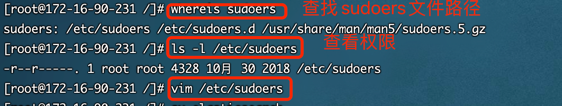

1、不能使用root用户启动es
2、创建用户
root用户登录增加用户命令：adduser elasticsearch
初始化密码 passwd xxxxxx
3、进行授权
个人用户的权限只可以在本home下有完整的权限，其他目录需要别人授权。如果需要root用户的权限，可以通过修改sudoers文件来赋予权限
新创建的用户不能使用sudo命令，需要给他添加授权


elasticsearch为了安全性，不可以使用root用户启动，需要切换账号或者新建账号
```java
[WARN ][o.e.b.ElasticsearchUncaughtExceptionHandler] [unknown] uncaught exception in thread [main]
org.elasticsearch.bootstrap.StartupException: java.lang.RuntimeException: can not run elasticsearch as root
    at org.elasticsearch.bootstrap.Elasticsearch.init(Elasticsearch.java:163) ~[elasticsearch-6.6.0.jar:6.6.0]
    at org.elasticsearch.bootstrap.Elasticsearch.execute(Elasticsearch.java:150) ~[elasticsearch-6.6.0.jar:6.6.0]
    at org.elasticsearch.cli.EnvironmentAwareCommand.execute(EnvironmentAwareCommand.java:86) ~[elasticsearch-6.6.0.jar:6.6.0]
    at org.elasticsearch.cli.Command.mainWithoutErrorHandling(Command.java:124) ~[elasticsearch-cli-6.6.0.jar:6.6.0]
    at org.elasticsearch.cli.Command.main(Command.java:90) ~[elasticsearch-cli-6.6.0.jar:6.6.0]
    at org.elasticsearch.bootstrap.Elasticsearch.main(Elasticsearch.java:116) ~[elasticsearch-6.6.0.jar:6.6.0]
    at org.elasticsearch.bootstrap.Elasticsearch.main(Elasticsearch.java:93) ~[elasticsearch-6.6.0.jar:6.6.0]
Caused by: java.lang.RuntimeException: can not run elasticsearch as root
    at org.elasticsearch.bootstrap.Bootstrap.initializeNatives(Bootstrap.java:103) ~[elasticsearch-6.6.0.jar:6.6.0]
    at org.elasticsearch.bootstrap.Bootstrap.setup(Bootstrap.java:170) ~[elasticsearch-6.6.0.jar:6.6.0]
    at org.elasticsearch.bootstrap.Bootstrap.init(Bootstrap.java:333) ~[elasticsearch-6.6.0.jar:6.6.0]
    at org.elasticsearch.bootstrap.Elasticsearch.init(Elasticsearch.java:159) ~[elasticsearch-6.6.0.jar:6.6.0]
    ... 6 more
```

切换到root账号下，执行一下命令：
```shell
chown -R elasticsearch:elasticsearch /data/es
```

```java
Exception in thread "main" java.nio.file.AccessDeniedException: /usr/web/elasticsearch/elasticsearch-6.6.0/config/jvm.options
    at sun.nio.fs.UnixException.translateToIOException(UnixException.java:84)
    at sun.nio.fs.UnixException.rethrowAsIOException(UnixException.java:102)
    at sun.nio.fs.UnixException.rethrowAsIOException(UnixException.java:107)
    at sun.nio.fs.UnixFileSystemProvider.newByteChannel(UnixFileSystemProvider.java:214)
    at java.nio.file.Files.newByteChannel(Files.java:361)
    at java.nio.file.Files.newByteChannel(Files.java:407)
    at java.nio.file.spi.FileSystemProvider.newInputStream(FileSystemProvider.java:384)
    at java.nio.file.Files.newInputStream(Files.java:152)
    at org.elasticsearch.tools.launchers.JvmOptionsParser.main(JvmOptionsParser.java:60)
```

```shell
curl: (7) Failed connect to localhost:9200; 拒绝连接
 max virtual memory areas vm.max_map_count [65530] is too low, increase to at least [262144]
```

解决方案：
切换到root用户下，执行如下命令:
```shell
sysctl -w vm.max_map_count=262144
```
执行下面命令查看：
```shell
sysctl -a|grep vm.max_map_count
```
修改文件 vim /etc/sysctl.conf 文件最后一行增加
```shell
vm.max_map_count=262144
```
最后执行命令，立即生效
```shell
sysctl -p
```
然后进入bin目录下./elasticsearch 即可启动

执行如下命令：
```shell
curl localhost:9200
```


关闭防火墙
```shell
systemctl stop firewalld.service
```
防火墙状态查看
```shell
firewall-cmd --state
systemctl status firewalld.service
```
查看防火墙开放的端口
```shell
firewall-cmd --permanent --list-ports
```
开放9200端口
```shell
firewall-cmd --permanent --add-port=9200/tcp
```