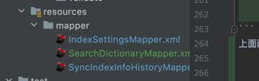

```shell
org.springframework.beans.factory.BeanCreationException: Error creating bean with name 'healthEndpointGroupsBeanPostProcessor' defined in class path resource [org/springframework/boot/actuate/autoconfigure/health/HealthEndpointConfiguration.class]: BeanPostProcessor before instantiation of bean failed; nested exception is java.lang.IllegalArgumentException: ProceedingJoinPoint is only supported for around advice
	at org.springframework.beans.factory.support.AbstractAutowireCapableBeanFactory.createBean(AbstractAutowireCapableBeanFactory.java:511) ~[spring-beans-5.2.12.RELEASE.jar:5.2.12.RELEASE]
	at org.springframework.beans.factory.support.AbstractBeanFactory.lambda$doGetBean$0(AbstractBeanFactory.java:324) ~[spring-beans-5.2.12.RELEASE.jar:5.2.12.RELEASE]
	at org.springframework.beans.factory.support.DefaultSingletonBeanRegistry.getSingleton(DefaultSingletonBeanRegistry.java:234) ~[spring-beans-5.2.12.RELEASE.jar:5.2.12.RELEASE]
	at org.springframework.beans.factory.support.AbstractBeanFactory.doGetBean(AbstractBeanFactory.java:322) ~[spring-beans-5.2.12.RELEASE.jar:5.2.12.RELEASE]
	at org.springframework.beans.factory.support.AbstractBeanFactory.getBean(AbstractBeanFactory.java:207) ~[spring-beans-5.2.12.RELEASE.jar:5.2.12.RELEASE]
```

服务启动过程中遇到如上异常，从中可以看到是因为切面写的有问题：

```shell
ProceedingJoinPoint is only supported for around advice
```

```shell
org.springframework.web.bind.MethodArgumentNotValidException: Validation failed for argument [0] in public com.search.admin.infra.base.Result<java.lang.String> com.search.admin.adapter.controller.IndexController.createIndexMapping(com.search.admin.adapter.request.IndexAddRequestVO): [Field error in object 'indexAddRequestVO' on field 'indexName': rejected value []; codes [NotBlank.indexAddRequestVO.indexName,NotBlank.indexName,NotBlank.java.lang.String,NotBlank]; arguments [org.springframework.context.support.DefaultMessageSourceResolvable: codes [indexAddRequestVO.indexName,indexName]; arguments []; default message [indexName]]; default message [不能为空]] 
	at org.springframework.web.servlet.mvc.method.annotation.RequestResponseBodyMethodProcessor.resolveArgument(RequestResponseBodyMethodProcessor.java:139) ~[spring-webmvc-5.2.12.RELEASE.jar:5.2.12.RELEASE]
	at org.springframework.web.method.support.HandlerMethodArgumentResolverComposite.resolveArgument(HandlerMethodArgumentResolverComposite.java:121) ~[spring-web-5.2.12.RELEASE.jar:5.2.12.RELEASE]
	at org.springframework.web.method.support.InvocableHandlerMethod.getMethodArgumentValues(InvocableHandlerMethod.java:167) ~[spring-web-5.2.12.RELEASE.jar:5.2.12.RELEASE]
	at org.springframework.web.method.support.InvocableHandlerMethod.invokeForRequest(InvocableHandlerMethod.java:134) ~[spring-web-5.2.12.RELEASE.jar:5.2.12.RELEASE]
	at org.springframework.web.servlet.mvc.method.annotation.ServletInvocableHandlerMethod.invokeAndHandle(ServletInvocableHandlerMethod.java:105) ~[spring-webmvc-5.2.12.RELEASE.jar:5.2.12.RELEASE]
	at org.springframework.web.servlet.mvc.method.annotation.RequestMappingHandlerAdapter.invokeHandlerMethod(RequestMappingHandlerAdapter.java:878) ~[spring-webmvc-5.2.12.RELEASE.jar:5.2.12.RELEASE]
	at org.springframework.web.servlet.mvc.method.annotation.RequestMappingHandlerAdapter.handleInternal(RequestMappingHandlerAdapter.java:792) ~[spring-webmvc-5.2.12.RELEASE.jar:5.2.12.RELEASE]
	at org.springframework.web.servlet.mvc.method.AbstractHandlerMethodAdapter.handle(AbstractHandlerMethodAdapter.java:87) ~[spring-webmvc-5.2.12.RELEASE.jar:5.2.12.RELEASE]
	at org.springframework.web.servlet.DispatcherServlet.doDispatch(DispatcherServlet.java:1040) ~[spring-webmvc-5.2.12.RELEASE.jar:5.2.12.RELEASE]
	at org.springframework.web.servlet.DispatcherServlet.doService(DispatcherServlet.java:943) ~[spring-webmvc-5.2.12.RELEASE.jar:5.2.12.RELEASE]
	at org.springframework.web.servlet.FrameworkServlet.processRequest(FrameworkServlet.java:1006) ~[spring-webmvc-5.2.12.RELEASE.jar:5.2.12.RELEASE]
	at org.springframework.web.servlet.FrameworkServlet.doPost(FrameworkServlet.java:909) ~[spring-webmvc-5.2.12.RELEASE.jar:5.2.12.RELEASE]
	at javax.servlet.http.HttpServlet.service(HttpServlet.java:652) ~[tomcat-embed-core-9.0.41.jar:4.0.FR]
	at org.springframework.web.servlet.FrameworkServlet.service(FrameworkServlet.java:883) ~[spring-webmvc-5.2.12.RELEASE.jar:5.2.12.RELEASE]
	at javax.servlet.http.HttpServlet.service(HttpServlet.java:733) ~[tomcat-embed-core-9.0.41.jar:4.0.FR]
	at org.apache.catalina.core.ApplicationFilterChain.internalDoFilter(ApplicationFilterChain.java:231) ~[tomcat-embed-core-9.0.41.jar:9.0.41]
	at org.apache.catalina.core.ApplicationFilterChain.doFilter(ApplicationFilterChain.java:166) ~[tomcat-embed-core-9.0.41.jar:9.0.41]
	at org.apache.tomcat.websocket.server.WsFilter.doFilter(WsFilter.java:53) ~[tomcat-embed-websocket-9.0.41.jar:9.0.41]
	at org.apache.catalina.core.ApplicationFilterChain.internalDoFilter(ApplicationFilterChain.java:193) ~[tomcat-embed-core-9.0.41.jar:9.0.41]
	at org.apache.catalina.core.ApplicationFilterChain.doFilter(ApplicationFilterChain.java:166) ~[tomcat-embed-core-9.0.41.jar:9.0.41]
	at org.springframework.web.filter.RequestContextFilter.doFilterInternal(RequestContextFilter.java:100) ~[spring-web-5.2.12.RELEASE.jar:5.2.12.RELEASE]
	at org.springframework.web.filter.OncePerRequestFilter.doFilter(OncePerRequestFilter.java:119) ~[spring-web-5.2.12.RELEASE.jar:5.2.12.RELEASE]
	at org.apache.catalina.core.ApplicationFilterChain.internalDoFilter(ApplicationFilterChain.java:193) ~[tomcat-embed-core-9.0.41.jar:9.0.41]
	at org.apache.catalina.core.ApplicationFilterChain.doFilter(ApplicationFilterChain.java:166) ~[tomcat-embed-core-9.0.41.jar:9.0.41]
	at org.springframework.web.filter.FormContentFilter.doFilterInternal(FormContentFilter.java:93) ~[spring-web-5.2.12.RELEASE.jar:5.2.12.RELEASE]
	at org.springframework.web.filter.OncePerRequestFilter.doFilter(OncePerRequestFilter.java:119) ~[spring-web-5.2.12.RELEASE.jar:5.2.12.RELEASE]
	at org.apache.catalina.core.ApplicationFilterChain.internalDoFilter(ApplicationFilterChain.java:193) ~[tomcat-embed-core-9.0.41.jar:9.0.41]
	at org.apache.catalina.core.ApplicationFilterChain.doFilter(ApplicationFilterChain.java:166) ~[tomcat-embed-core-9.0.41.jar:9.0.41]
	at org.springframework.boot.actuate.metrics.web.servlet.WebMvcMetricsFilter.doFilterInternal(WebMvcMetricsFilter.java:93) ~[spring-boot-actuator-2.3.7.RELEASE.jar:2.3.7.RELEASE]
	at org.springframework.web.filter.OncePerRequestFilter.doFilter(OncePerRequestFilter.java:119) ~[spring-web-5.2.12.RELEASE.jar:5.2.12.RELEASE]
	at org.apache.catalina.core.ApplicationFilterChain.internalDoFilter(ApplicationFilterChain.java:193) ~[tomcat-embed-core-9.0.41.jar:9.0.41]
	at org.apache.catalina.core.ApplicationFilterChain.doFilter(ApplicationFilterChain.java:166) ~[tomcat-embed-core-9.0.41.jar:9.0.41]
	at org.springframework.web.filter.CharacterEncodingFilter.doFilterInternal(CharacterEncodingFilter.java:201) ~[spring-web-5.2.12.RELEASE.jar:5.2.12.RELEASE]
	at org.springframework.web.filter.OncePerRequestFilter.doFilter(OncePerRequestFilter.java:119) ~[spring-web-5.2.12.RELEASE.jar:5.2.12.RELEASE]
	at org.apache.catalina.core.ApplicationFilterChain.internalDoFilter(ApplicationFilterChain.java:193) ~[tomcat-embed-core-9.0.41.jar:9.0.41]
	at org.apache.catalina.core.ApplicationFilterChain.doFilter(ApplicationFilterChain.java:166) ~[tomcat-embed-core-9.0.41.jar:9.0.41]
	at org.apache.catalina.core.StandardWrapperValve.invoke(StandardWrapperValve.java:202) ~[tomcat-embed-core-9.0.41.jar:9.0.41]
	at org.apache.catalina.core.StandardContextValve.invoke(StandardContextValve.java:97) ~[tomcat-embed-core-9.0.41.jar:9.0.41]
	at org.apache.catalina.authenticator.AuthenticatorBase.invoke(AuthenticatorBase.java:542) ~[tomcat-embed-core-9.0.41.jar:9.0.41]
	at org.apache.catalina.core.StandardHostValve.invoke(StandardHostValve.java:143) ~[tomcat-embed-core-9.0.41.jar:9.0.41]
	at org.apache.catalina.valves.ErrorReportValve.invoke(ErrorReportValve.java:92) ~[tomcat-embed-core-9.0.41.jar:9.0.41]
	at org.apache.catalina.core.StandardEngineValve.invoke(StandardEngineValve.java:78) ~[tomcat-embed-core-9.0.41.jar:9.0.41]
	at org.apache.catalina.connector.CoyoteAdapter.service(CoyoteAdapter.java:343) ~[tomcat-embed-core-9.0.41.jar:9.0.41]
	at org.apache.coyote.http11.Http11Processor.service(Http11Processor.java:374) ~[tomcat-embed-core-9.0.41.jar:9.0.41]
	at org.apache.coyote.AbstractProcessorLight.process(AbstractProcessorLight.java:65) ~[tomcat-embed-core-9.0.41.jar:9.0.41]
	at org.apache.coyote.AbstractProtocol$ConnectionHandler.process(AbstractProtocol.java:888) ~[tomcat-embed-core-9.0.41.jar:9.0.41]
	at org.apache.tomcat.util.net.NioEndpoint$SocketProcessor.doRun(NioEndpoint.java:1597) ~[tomcat-embed-core-9.0.41.jar:9.0.41]
	at org.apache.tomcat.util.net.SocketProcessorBase.run(SocketProcessorBase.java:49) ~[tomcat-embed-core-9.0.41.jar:9.0.41]
	at java.base/java.util.concurrent.ThreadPoolExecutor.runWorker(ThreadPoolExecutor.java:1136) ~[na:na]
	at java.base/java.util.concurrent.ThreadPoolExecutor$Worker.run(ThreadPoolExecutor.java:635) ~[na:na]
	at org.apache.tomcat.util.threads.TaskThread$WrappingRunnable.run(TaskThread.java:61) ~[tomcat-embed-core-9.0.41.jar:9.0.41]
	at java.base/java.lang.Thread.run(Thread.java:833) ~[na:na]
```

通过bindingResult来获取对应方法参数校验失败的具体信息

```shell
javax.validation.ConstraintDefinitionException: HV000074: com.search.admin.infra.validate.FieldTypeValid contains Constraint annotation, but does not contain a groups parameter.
	at org.hibernate.validator.internal.metadata.core.ConstraintHelper.assertGroupsParameterExists(ConstraintHelper.java:1045) ~[hibernate-validator-6.1.6.Final.jar:6.1.6.Final]
	at org.hibernate.validator.internal.metadata.core.ConstraintHelper.lambda$isConstraintAnnotation$3(ConstraintHelper.java:1007) ~[hibernate-validator-6.1.6.Final.jar:6.1.6.Final]
	at java.base/java.util.concurrent.ConcurrentHashMap.computeIfAbsent(ConcurrentHashMap.java:1708) ~[na:na]
	at org.hibernate.validator.internal.metadata.core.ConstraintHelper.isConstraintAnnotation(ConstraintHelper.java:1005) ~[hibernate-validator-6.1.6.Final.jar:6.1.6.Final]
	at org.hibernate.va
```

使用了自定义注解，但是没有定义groups和payload方法

```java
public @interface CheckName {
    String message();

    Class<?>[] groups() default {};

    Class<? extends Payload>[] payload() default {};
}

```

```shell
org.springframework.beans.factory.BeanDefinitionStoreException: Failed to read candidate component class: file [/Users/yongyongli/open/search-admin/search-admin-app/target/classes/com/search/admin/app/service/IndexService.class]; nested exception is org.springframework.core.NestedIOException: ASM ClassReader failed to parse class file - probably due to a new Java class file version that isn't supported yet: file [/Users/yongyongli/open/search-admin/search-admin-app/target/classes/com/search/admin/app/service/IndexService.class]; nested exception is java.lang.IllegalArgumentException: Unsupported class file major version 61
	at org.springframework.context.annotation.ClassPathScanningCandidateComponentProvider.scanCandidateComponents(ClassPathScanningCandidateComponentProvider.java:452) ~[spring-context-5.2.12.RELEASE.jar:5.2.12.RELEASE]
	at org.springframework.context.annotation.ClassPathScanningCandidateComponentProvider.findCandidateComponents(ClassPathScanningCandidateComponentProvider.java:315) ~[spring-context-5.2.12.RELEASE.jar:5.2.12.RELEASE]
	at org.springframework.context.annotation.ClassPathBeanDefinitionScanner.doScan(ClassPathBeanDefinitionScanner.java:276) ~[spring-context-5.2.12.RELEASE.jar:5.2.12.RELEASE]
Caused by: java.lang.IllegalArgumentException: Unsupported class file major version 61
	at org.springframework.asm.ClassReader.<init>(ClassReader.java:196) ~[spring-core-5.2.12.RELEASE.jar:5.2.12.RELEASE]
	at org.springframework.asm.ClassReader.<init>(ClassReader.java:177) ~[spring-core-5.2.12.RELEASE.jar:5.2.12.RELEASE]
	at org.springframework.asm.ClassReader.<init>(ClassReader.java:163) ~[spring-core-5.2.12.RELEASE.jar:5.2.12.RELEASE]
	at org.springframework.asm.ClassReader.<init>(ClassReader.java:284) ~[spring-core-5.2.12.RELEASE.jar:5.2.12.RELEASE]
	at org.springframework.core.type.classreading.SimpleMetadataReader.getClassReader(SimpleMetadataReader.java:57) ~[spring-core-5.2.12.RELEASE.jar:5.2.12.RELEASE]
	... 25 common frames omitted
```

出现上述原因：springboot的版本和spring cloud的版本不匹配导致

查找springCloud对应的springboot版本
https://start.spring.io/actuator/info

```shell
Description:

The dependencies of some of the beans in the application context form a cycle:

┌─────┐
|  nacosProperties (field private java.util.Optional com.alibaba.cloud.nacos.NacosDiscoveryProperties.nacosAutoServiceRegistrationOptional)
↑     ↓
|  nacosAutoServiceRegistration defined in class path resource [com/alibaba/cloud/nacos/registry/NacosServiceRegistryAutoConfiguration.class]
↑     ↓
|  nacosServiceRegistry defined in class path resource [com/alibaba/cloud/nacos/registry/NacosServiceRegistryAutoConfiguration.class]
└─────┘


Action:

Relying upon circular references is discouraged and they are prohibited by default. Update your application to remove the dependency cycle between beans. As a last resort, it may be possible to break the cycle automatically by setting spring.main.allow-circular-references to true.

```

上述问题是一个循环依赖的问题,设置可循环依赖

```yaml
spring:
  main:
    allow-circular-references: true
```

但是此时nacos作为注册中心和配置中心会失效,原来nacos配置的key无效导致
```shell
2022-02-09 11:02:18.158  WARN 13012 --- [           main] o.s.boot.actuate.endpoint.EndpointId     : Endpoint ID 'nacos-config' contains invalid characters, please migrate to a valid format.
2022-02-09 11:02:18.160  WARN 13012 --- [           main] o.s.boot.actuate.endpoint.EndpointId     : Endpoint ID 'nacos-discovery' contains invalid characters, please migrate to a valid format.
```
原来的配置方式：
```yaml
spring:
  application:
    name: search-admin
  profiles:
    active: dev3
  cloud:
    nacos:
      discovery:
        server-addr: 172.16.113.41:8848
      config:
        server-addr: 172.16.113.41:8848
```
新的配置方式：
```yaml

```

```shell
java.lang.NoClassDefFoundError: jakarta/json/spi/JsonProvider
	at java.base/java.lang.ClassLoader.defineClass1(Native Method) ~[na:na]
	at java.base/java.lang.ClassLoader.defineClass(ClassLoader.java:1012) ~[na:na]
	at java.base/java.security.SecureClassLoader.defineClass(SecureClassLoader.java:150) ~[na:na]
	at java.base/jdk.internal.loader.BuiltinClassLoader.defineClass(BuiltinClassLoader.java:862) ~[na:na]
	at java.base/jdk.internal.loader.BuiltinClassLoader.findClassOnClassPathOrNull(BuiltinClassLoader.java:760) ~[na:na]
	at java.base/jdk.internal.loader.BuiltinClassLoader.loadClassOrNull(BuiltinClassLoader.java:681) ~[na:na]
	at java.base/jdk.internal.loader.BuiltinClassLoader.loadClass(BuiltinClassLoader.java:639) ~[na:na]
	at java.base/jdk.internal.loader.ClassLoaders$AppClassLoader.loadClass(ClassLoaders.java:188) ~[na:na]
	at java.base/java.lang.ClassLoader.loadClass(ClassLoader.java:520) ~[na:na]
	at co.elastic.clients.json.jackson.JacksonJsonpMapper.<init>(JacksonJsonpMapper.java:43) ~[elasticsearch-java-7.16.3.jar:na]
	at co.elastic.clients.json.jackson.JacksonJsonpMapper.<init>(JacksonJsonpMapper.java:50) ~[elasticsearch-java-7.16.3.jar:na]
	at com.search.admin.infra.config.SearchAdminClient.elasticsearchClient(SearchAdminClient.java:34) ~[classes/:na]
```
引入依赖即可：
```xml
<dependency>
    <groupId>jakarta.json</groupId>
    <artifactId>jakarta.json-api</artifactId>
    <version>${jakarta.json.version}</version>
    <scope>compile</scope>
</dependency>
```

```shell
org.elasticsearch.client.ResponseException: method [POST], host [http://172.16.90.231:9200], URI [/_analyze], status line [HTTP/1.1 406 Not Acceptable]
{"error":"Content-Type header [application/vnd.elasticsearch+json; compatible-with=7] is not supported","status":406}
	at org.elasticsearch.client.RestClient.convertResponse(RestClient.java:326) ~[elasticsearch-rest-client-7.15.2.jar:7.15.2]
	at org.elasticsearch.client.RestClient.performRequest(RestClient.java:296) ~[elasticsearch-rest-client-7.15.2.jar:7.15.2]
	at org.elasticsearch.client.RestClient.performRequest(RestClient.java:270) ~[elasticsearch-rest-client-7.15.2.jar:7.15.2]
```

```shell
java.lang.NoClassDefFoundError: org/elasticsearch/common/CheckedConsumer
	at org.elasticsearch.client.RestHighLevelClient.<init>(RestHighLevelClient.java:287) ~[elasticsearch-rest-high-level-client-7.9.3.jar:7.15.2]
	at org.elasticsearch.client.RestHighLevelClient.<init>(RestHighLevelClient.java:279) ~[elasticsearch-rest-high-level-client-7.9.3.jar:7.15.2]
	at com.search.admin.infra.config.SearchAdminClient.elasticsearchClient(SearchAdminClient.java:31) ~[classes/:na]
	at com.search.admin.infra.config.SearchAdminClient$$EnhancerBySpringCGLIB$$2f7847bc.CGLIB$elasticsearchClient$0(<generated>) ~[classes/:na]
	at com.search.admin.infra.config.SearchAdminClient$$EnhancerBySpringCGLIB$$2f7847bc$$FastClassBySpringCGLIB$$920945b6.invoke(<generated>) ~[classes/:na]
	at org.springframework.cglib.proxy.MethodProxy.invokeSuper(MethodProxy.java:244) ~[spring-core-5.3.15.jar:5.3.15]
	at org.springframework.context.annotation.ConfigurationClassEnhancer$BeanMethodInterceptor.intercept(ConfigurationClassEnhancer.java:331) ~[spring-context-5.3.15.jar:5.3.15]
	at com.search.admin.infra.config.SearchAdminClient$$EnhancerBySpringCGLIB$$2f7847bc.elasticsearchClient(<generated>) ~[classes/:na]
	at com.search.admin.infra.config.SearchAdminClient$$FastClassBySpringCGLIB$$69dc81dc.invoke(<generated>) ~[classes/:na]
	at org.springframework.cglib.proxy.MethodProxy.invoke(MethodProxy.java:218) ~[spring-core-5.3.15.jar:5.3.15]
	at org.springframework.aop.framework.CglibAopProxy$CglibMethodInvocation.invokeJoinpoint(CglibAopProxy.java:783) ~[spring-aop-5.3.15.jar:5.3.15]
	at org.springframework.aop.framework.ReflectiveMethodInvocation.proceed(ReflectiveMethodInvocation.java:163) ~[spring-aop-5.3.15.jar:5.3.15]
	at org.springframework.aop.framework.CglibAopProxy$CglibMethodInvocation.proceed(CglibAopProxy.java:753) ~[spring-aop-5.3.15.jar:5.3.15]
	at org.springframework.aop.framework.adapter.MethodBeforeAdviceInterceptor.invoke(MethodBeforeAdviceInterceptor.java:58) ~[spring-aop-5.3.15.jar:5.3.15]
	at org.springframework.aop.framework.ReflectiveMethodInvocation.proceed(ReflectiveMethodInvocation.java:186) ~[spring-aop-5.3.15.jar:5.3.15]
	at org.springframework.aop.framework.CglibAopProxy$CglibMethodInvocation.proceed(CglibAopProxy.java:753) ~[spring-aop-5.3.15.jar:5.3.15]
	at org.springframework.aop.aspectj.MethodInvocationProceedingJoinPoint.proceed(MethodInvocationProceedingJoinPoint.java:89) ~[spring-aop-5.3.15.jar:5.3.15]
	at com.search.admin.infra.aop.RequestLogAspect.executeAround(RequestLogAspect.java:54) ~[classes/:na]
	at java.base/jdk.internal.reflect.NativeMethodAccessorImpl.invoke0(Native Method) ~[na:na]
	at java.base/jdk.internal.reflect.NativeMethodAccessorImpl.invoke(NativeMethodAccessorImpl.java:77) ~[na:na]
	at java.base/jdk.internal.reflect.DelegatingMethodAccessorImpl.invoke(DelegatingMethodAccessorImpl.java:43) ~[na:na]
	at java.base/java.lang.reflect.Method.invoke(Method.java:568) ~[na:na]
	at org.springframework.aop.aspectj.AbstractAspectJAdvice.invokeAdviceMethodWithGivenArgs(AbstractAspectJAdvice.java:634) ~[spring-aop-5.3.15.jar:5.3.15]
	at org.springframework.aop.aspectj.AbstractAspectJAdvice.invokeAdviceMethod(AbstractAspectJAdvice.java:624) ~[spring-aop-5.3.15.jar:5.3.15]
	at org.springframework.aop.aspectj.AspectJAroundAdvice.invoke(AspectJAroundAdvice.java:72) ~[spring-aop-5.3.15.jar:5.3.15]
	at org.springframework.aop.framework.ReflectiveMethodInvocation.proceed(ReflectiveMethodInvocation.java:186) ~[spring-aop-5.3.15.jar:5.3.15]
	at org.springframework.aop.framework.CglibAopProxy$CglibMethodInvocation.proceed(CglibAopProxy.java:753) ~[spring-aop-5.3.15.jar:5.3.15]
	at org.springframework.aop.interceptor.ExposeInvocationInterceptor.invoke(ExposeInvocationInterceptor.java:97) ~[spring-aop-5.3.15.jar:5.3.15]
	at org.springframework.aop.framework.ReflectiveMethodInvocation.proceed(ReflectiveMethodInvocation.java:186) ~[spring-aop-5.3.15.jar:5.3.15]
	at org.springframework.aop.framework.CglibAopProxy$CglibMethodInvocation.proceed(CglibAopProxy.java:753) ~[spring-aop-5.3.15.jar:5.3.15]
	at org.springframework.aop.framework.CglibAopProxy$DynamicAdvisedInterceptor.intercept(CglibAopProxy.java:698) ~[spring-aop-5.3.15.jar:5.3.15]
	at com.search.admin.infra.config.SearchAdminClient$$EnhancerBySpringCGLIB$$c8d8a2c7.elasticsearchClient(<generated>) ~[classes/:na]
	at java.base/jdk.internal.reflect.NativeMethodAccessorImpl.invoke0(Native Method) ~[na:na]
	at java.base/jdk.internal.reflect.NativeMethodAccessorImpl.invoke(NativeMethodAccessorImpl.java:77) ~[na:na]
	at java.base/jdk.internal.reflect.DelegatingMethodAccessorImpl.invoke(DelegatingMethodAccessorImpl.java:43) ~[na:na]
	at java.base/java.lang.reflect.Method.invoke(Method.java:568) ~[na:na]
	at org.springframework.beans.factory.support.SimpleInstantiationStrategy.instantiate(SimpleInstantiationStrategy.java:154) ~[spring-beans-5.3.15.jar:5.3.15]
	at org.springframework.beans.factory.support.ConstructorResolver.instantiate(ConstructorResolver.java:653) ~[spring-beans-5.3.15.jar:5.3.15]
	at org.springframework.beans.factory.support.ConstructorResolver.instantiateUsingFactoryMethod(ConstructorResolver.java:486) ~[spring-beans-5.3.15.jar:5.3.15]
	at org.springframework.beans.factory.support.AbstractAutowireCapableBeanFactory.instantiateUsingFactoryMethod(AbstractAutowireCapableBeanFactory.java:1352) ~[spring-beans-5.3.15.jar:5.3.15]
	at org.springframework.beans.factory.support.AbstractAutowireCapableBeanFactory.createBeanInstance(AbstractAutowireCapableBeanFactory.java:1195) ~[spring-beans-5.3.15.jar:5.3.15]
	at org.springframework.beans.factory.support.AbstractAutowireCapableBeanFactory.doCreateBean(AbstractAutowireCapableBeanFactory.java:582) ~[spring-beans-5.3.15.jar:5.3.15]
	at org.springframework.beans.factory.support.AbstractAutowireCapableBeanFactory.createBean(AbstractAutowireCapableBeanFactory.java:542) ~[spring-beans-5.3.15.jar:5.3.15]
	at org.springframework.beans.factory.support.AbstractBeanFactory.lambda$doGetBean$0(AbstractBeanFactory.java:335) ~[spring-beans-5.3.15.jar:5.3.15]
	at org.springframework.beans.factory.support.DefaultSingletonBeanRegistry.getSingleton(DefaultSingletonBeanRegistry.java:234) ~[spring-beans-5.3.15.jar:5.3.15]
	at org.springframework.beans.factory.support.AbstractBeanFactory.doGetBean(AbstractBeanFactory.java:333) ~[spring-beans-5.3.15.jar:5.3.15]
	at org.springframework.beans.factory.support.AbstractBeanFactory.getBean(AbstractBeanFactory.java:208) ~[spring-beans-5.3.15.jar:5.3.15]
	at org.springframework.beans.factory.support.DefaultListableBeanFactory.preInstantiateSingletons(DefaultListableBeanFactory.java:953) ~[spring-beans-5.3.15.jar:5.3.15]
	at org.springframework.context.support.AbstractApplicationContext.finishBeanFactoryInitialization(AbstractApplicationContext.java:918) ~[spring-context-5.3.15.jar:5.3.15]
	at org.springframework.context.support.AbstractApplicationContext.refresh(AbstractApplicationContext.java:583) ~[spring-context-5.3.15.jar:5.3.15]
	at org.springframework.boot.web.servlet.context.ServletWebServerApplicationContext.refresh(ServletWebServerApplicationContext.java:145) ~[spring-boot-2.6.3.jar:2.6.3]
	at org.springframework.boot.SpringApplication.refresh(SpringApplication.java:732) ~[spring-boot-2.6.3.jar:2.6.3]
	at org.springframework.boot.SpringApplication.refreshContext(SpringApplication.java:414) ~[spring-boot-2.6.3.jar:2.6.3]
	at org.springframework.boot.SpringApplication.run(SpringApplication.java:302) ~[spring-boot-2.6.3.jar:2.6.3]
	at org.springframework.boot.SpringApplication.run(SpringApplication.java:1303) ~[spring-boot-2.6.3.jar:2.6.3]
	at org.springframework.boot.SpringApplication.run(SpringApplication.java:1292) ~[spring-boot-2.6.3.jar:2.6.3]
	at com.search.admin.adapter.SearchAdminApplication.main(SearchAdminApplication.java:14) ~[classes/:na]
Caused by: java.lang.ClassNotFoundException: org.elasticsearch.common.CheckedConsumer
	at java.base/jdk.internal.loader.BuiltinClassLoader.loadClass(BuiltinClassLoader.java:641) ~[na:na]
	at java.base/jdk.internal.loader.ClassLoaders$AppClassLoader.loadClass(ClassLoaders.java:188) ~[na:na]
	at java.base/java.lang.ClassLoader.loadClass(ClassLoader.java:520) ~[na:na]
```
上面两个异常都是因为ES的版本和api的版本不一致导致


```shell
org.apache.ibatis.binding.BindingException: Invalid bound statement (not found): com.search.admin.infra.storage.mapper.SearchDictionaryMapper.listByValidateConditions
	at org.apache.ibatis.binding.MapperMethod$SqlCommand.<init>(MapperMethod.java:235) ~[mybatis-3.5.9.jar:3.5.9]
	at com.baomidou.mybatisplus.core.override.MybatisMapperMethod.<init>(MybatisMapperMethod.java:50) ~[mybatis-plus-core-3.5.1.jar:3.5.1]
```

生成的mapper的xml文件放错位置，应该放在resource下，还需要在pom中添加一段内容，如下图所示：

application.yaml中增加如下内容
```yaml
mybatis-plus:
  mapper-locations: classpath:/mapper/**/**/*Mapper.xml
```

```shell
org.mybatis.spring.MyBatisSystemException: nested exception is org.apache.ibatis.binding.BindingException: Parameter 'listByValidateConditions' not found. Available parameters are [validateCondition, param1]
	at org.mybatis.spring.MyBatisExceptionTranslator.translateExceptionIfPossible(MyBatisExceptionTranslator.java:96) ~[mybatis-spring-2.0.6.jar:2.0.6]
	at org.mybatis.spring.SqlSessionTemplate$SqlSessionInterceptor.invoke(SqlSessionTemplate.java:441) ~[mybatis-spring-2.0.6.jar:2.0.6]
	at jdk.proxy2/jdk.proxy2.$Proxy98.selectList(Unknown Source) ~[na:na]
	at org.mybatis.spring.SqlSessionTemplate.selectList(SqlSessionTemplate.java:224) ~[mybatis-spring-2.0.6.jar:2.0.6]
	at com.baomidou.mybatisplus.core.override.MybatisMapperMethod.executeForMany(MybatisMapperMethod.java:166) ~[mybatis-plus-core-3.5.1.jar:3.5.1]
	at com.baomidou.mybatisplus.core.override.MybatisMapperMethod.execute(MybatisMapperMethod.java:77) ~[mybatis-plus-core-3.5.1.jar:3.5.1]
	at com.baomidou.mybatisplus.core.override.MybatisMapperProxy$PlainMethodInvoker.invoke(MybatisMapperProxy.java:148) ~[mybatis-plus-core-3.5.1.jar:3.5.1]
	at com.baomidou.mybatisplus.core.override.MybatisMapperProxy.invoke(MybatisMapperProxy.java:89) ~[mybatis-plus-core-3.5.1.jar:3.5.1]
	at jdk.proxy2/jdk.proxy2.$Proxy103.listByValidateConditions(Unknown Source) ~[na:na]
	at java.base/jdk.internal.reflect.NativeMethodAccessorImpl.invoke0(Native Method) ~[na:na]
	at java.base/jdk.internal.reflect.NativeMethodAccessorImpl.invoke(NativeMethodAccessorImpl.java:77) ~[na:na]
	at java.base/jdk.internal.reflect.DelegatingMethodAccessorImpl.invoke(DelegatingMethodAccessorImpl.java:43) ~[na:na]
	at java.base/java.lang.reflect.Method.invoke(Method.java:568) ~[na:na]
	at org.springframework.aop.support.AopUtils.invokeJoinpointUsingReflection(AopUtils.java:344) ~[spring-aop-5.3.15.jar:5.3.15]
	at org.springframework.aop.framework.ReflectiveMethodInvocation.invokeJoinpoint(ReflectiveMethodInvocation.java:198) ~[spring-aop-5.3.15.jar:5.3.15]
	at org.springframework.aop.framework.ReflectiveMethodInvocation.proceed(ReflectiveMethodInvocation.java:163) ~[spring-aop-5.3.15.jar:5.3.15]
	at org.springframework.aop.framework.adapter.MethodBeforeAdviceInterceptor.invoke(MethodBeforeAdviceInterceptor.java:58) ~[spring-aop-5.3.15.jar:5.3.15]
	at org.springframework.aop.framework.ReflectiveMethodInvocation.proceed(ReflectiveMethodInvocation.java:186) ~[spring-aop-5.3.15.jar:5.3.15]
	at org.springframework.aop.interceptor.ExposeInvocationInterceptor.invoke(ExposeInvocationInterceptor.java:97) ~[spring-aop-5.3.15.jar:5.3.15]
	at org.springframework.aop.framework.ReflectiveMethodInvocation.proceed(ReflectiveMethodInvocation.java:186) ~[spring-aop-5.3.15.jar:5.3.15]
	at org.springframework.aop.framework.JdkDynamicAopProxy.invoke(JdkDynamicAopProxy.java:215) ~[spring-aop-5.3.15.jar:5.3.15]
	at jdk.proxy2/jdk.proxy2.$Proxy104.listByValidateConditions(Unknown Source) ~[na:na]
	at com.search.admin.infra.storage.service.impl.SearchDictionaryServiceImpl.listByValidateConditions(SearchDictionaryServiceImpl.java:25) ~[classes/:na]
	at com.search.admin.infra.storage.service.impl.SearchDictionaryServiceImpl$$FastClassBySpringCGLIB$$582744eb.invoke(<generated>) ~[classes/:na]
	at org.springframework.cglib.proxy.MethodProxy.invoke(MethodProxy.java:218) ~[spring-core-5.3.15.jar:5.3.15]
	at org.springframework.aop.framework.CglibAopProxy$CglibMethodInvocation.invokeJoinpoint(CglibAopProxy.java:783) ~[spring-aop-5.3.15.jar:5.3.15]
	at org.springframework.aop.framework.ReflectiveMethodInvocation.proceed(ReflectiveMethodInvocation.java:163) ~[spring-aop-5.3.15.jar:5.3.15]
	at org.springframework.aop.framework.CglibAopProxy$CglibMethodInvocation.proceed(CglibAopProxy.java:753) ~[spring-aop-5.3.15.jar:5.3.15]
	at org.springframework.aop.framework.adapter.MethodBeforeAdviceInterceptor.invoke(MethodBeforeAdviceInterceptor.java:58) ~[spring-aop-5.3.15.jar:5.3.15]
	at org.springframework.aop.framework.ReflectiveMethodInvocation.proceed(ReflectiveMethodInvocation.java:186) ~[spring-aop-5.3.15.jar:5.3.15]
	at org.springframework.aop.framework.CglibAopProxy$CglibMethodInvocation.proceed(CglibAopProxy.java:753) ~[spring-aop-5.3.15.jar:5.3.15]
	at org.springframework.aop.interceptor.ExposeInvocationInterceptor.invoke(ExposeInvocationInterceptor.java:97) ~[spring-aop-5.3.15.jar:5.3.15]
	at org.springframework.aop.framework.ReflectiveMethodInvocation.proceed(ReflectiveMethodInvocation.java:186) ~[spring-aop-5.3.15.jar:5.3.15]
	at org.springframework.aop.framework.CglibAopProxy$CglibMethodInvocation.proceed(CglibAopProxy.java:753) ~[spring-aop-5.3.15.jar:5.3.15]
	at org.springframework.aop.framework.CglibAopProxy$DynamicAdvisedInterceptor.intercept(CglibAopProxy.java:698) ~[spring-aop-5.3.15.jar:5.3.15]
	at com.search.admin.infra.storage.service.impl.SearchDictionaryServiceImpl$$EnhancerBySpringCGLIB$$2b0772ef.listByValidateConditions(<generated>) ~[classes/:na]
	at com.search.admin.domain.logic.DictionaryLogic.batchInsertDictionaries(DictionaryLogic.java:30) ~[classes/:na]
	at com.search.admin.domain.logic.DictionaryLogic$$FastClassBySpringCGLIB$$edd4a426.invoke(<generated>) ~[classes/:na]
	at org.springframework.cglib.proxy.MethodProxy.invoke(MethodProxy.java:218) ~[spring-core-5.3.15.jar:5.3.15]
	at org.springframework.aop.framework.CglibAopProxy$CglibMethodInvocation.invokeJoinpoint(CglibAopProxy.java:783) ~[spring-aop-5.3.15.jar:5.3.15]
	at org.springframework.aop.framework.ReflectiveMethodInvocation.proceed(ReflectiveMethodInvocation.java:163) ~[spring-aop-5.3.15.jar:5.3.15]
	at org.springframework.aop.framework.CglibAopProxy$CglibMethodInvocation.proceed(CglibAopProxy.java:753) ~[spring-aop-5.3.15.jar:5.3.15]
	at org.springframework.aop.framework.adapter.MethodBeforeAdviceInterceptor.invoke(MethodBeforeAdviceInterceptor.java:58) ~[spring-aop-5.3.15.jar:5.3.15]
	at org.springframework.aop.framework.ReflectiveMethodInvocation.proceed(ReflectiveMethodInvocation.java:186) ~[spring-aop-5.3.15.jar:5.3.15]
	at org.springframework.aop.framework.CglibAopProxy$CglibMethodInvocation.proceed(CglibAopProxy.java:753) ~[spring-aop-5.3.15.jar:5.3.15]
	at org.springframework.aop.interceptor.ExposeInvocationInterceptor.invoke(ExposeInvocationInterceptor.java:97) ~[spring-aop-5.3.15.jar:5.3.15]
	at org.springframework.aop.framework.ReflectiveMethodInvocation.proceed(ReflectiveMethodInvocation.java:186) ~[spring-aop-5.3.15.jar:5.3.15]
	at org.springframework.aop.framework.CglibAopProxy$CglibMethodInvocation.proceed(CglibAopProxy.java:753) ~[spring-aop-5.3.15.jar:5.3.15]
	at org.springframework.aop.framework.CglibAopProxy$DynamicAdvisedInterceptor.intercept(CglibAopProxy.java:698) ~[spring-aop-5.3.15.jar:5.3.15]
	at com.search.admin.domain.logic.DictionaryLogic$$EnhancerBySpringCGLIB$$d6a7a174.batchInsertDictionaries(<generated>) ~[classes/:na]
	at com.search.admin.domain.handler.DictionaryHandler.batchInsertDictionaries(DictionaryHandler.java:24) ~[classes/:na]
	at com.search.admin.domain.handler.DictionaryHandler$$FastClassBySpringCGLIB$$5448bb7e.invoke(<generated>) ~[classes/:na]
	at org.springframework.cglib.proxy.MethodProxy.invoke(MethodProxy.java:218) ~[spring-core-5.3.15.jar:5.3.15]
	at org.springframework.aop.framework.CglibAopProxy$CglibMethodInvocation.invokeJoinpoint(CglibAopProxy.java:783) ~[spring-aop-5.3.15.jar:5.3.15]
	at org.springframework.aop.framework.ReflectiveMethodInvocation.proceed(ReflectiveMethodInvocation.java:163) ~[spring-aop-5.3.15.jar:5.3.15]
	at org.springframework.aop.framework.CglibAopProxy$CglibMethodInvocation.proceed(CglibAopProxy.java:753) ~[spring-aop-5.3.15.jar:5.3.15]
	at org.springframework.aop.framework.adapter.MethodBeforeAdviceInterceptor.invoke(MethodBeforeAdviceInterceptor.java:58) ~[spring-aop-5.3.15.jar:5.3.15]
	at org.springframework.aop.framework.ReflectiveMethodInvocation.proceed(ReflectiveMethodInvocation.java:186) ~[spring-aop-5.3.15.jar:5.3.15]
	at org.springframework.aop.framework.CglibAopProxy$CglibMethodInvocation.proceed(CglibAopProxy.java:753) ~[spring-aop-5.3.15.jar:5.3.15]
	at org.springframework.aop.interceptor.ExposeInvocationInterceptor.invoke(ExposeInvocationInterceptor.java:97) ~[spring-aop-5.3.15.jar:5.3.15]
	at org.springframework.aop.framework.ReflectiveMethodInvocation.proceed(ReflectiveMethodInvocation.java:186) ~[spring-aop-5.3.15.jar:5.3.15]
	at org.springframework.aop.framework.CglibAopProxy$CglibMethodInvocation.proceed(CglibAopProxy.java:753) ~[spring-aop-5.3.15.jar:5.3.15]
	at org.springframework.aop.framework.CglibAopProxy$DynamicAdvisedInterceptor.intercept(CglibAopProxy.java:698) ~[spring-aop-5.3.15.jar:5.3.15]
	at com.search.admin.domain.handler.DictionaryHandler$$EnhancerBySpringCGLIB$$69413e7c.batchInsertDictionaries(<generated>) ~[classes/:na]
	at com.search.admin.app.service.impl.DictionaryServiceImpl.batchInsertDictionaries(DictionaryServiceImpl.java:22) ~[classes/:na]
	at com.search.admin.app.service.impl.DictionaryServiceImpl$$FastClassBySpringCGLIB$$a17e1a6f.invoke(<generated>) ~[classes/:na]
	at org.springframework.cglib.proxy.MethodProxy.invoke(MethodProxy.java:218) ~[spring-core-5.3.15.jar:5.3.15]
	at org.springframework.aop.framework.CglibAopProxy$CglibMethodInvocation.invokeJoinpoint(CglibAopProxy.java:783) ~[spring-aop-5.3.15.jar:5.3.15]
	at org.springframework.aop.framework.ReflectiveMethodInvocation.proceed(ReflectiveMethodInvocation.java:163) ~[spring-aop-5.3.15.jar:5.3.15]
	at org.springframework.aop.framework.CglibAopProxy$CglibMethodInvocation.proceed(CglibAopProxy.java:753) ~[spring-aop-5.3.15.jar:5.3.15]
	at org.springframework.aop.framework.adapter.MethodBeforeAdviceInterceptor.invoke(MethodBeforeAdviceInterceptor.java:58) ~[spring-aop-5.3.15.jar:5.3.15]
	at org.springframework.aop.framework.ReflectiveMethodInvocation.proceed(ReflectiveMethodInvocation.java:186) ~[spring-aop-5.3.15.jar:5.3.15]
	at org.springframework.aop.framework.CglibAopProxy$CglibMethodInvocation.proceed(CglibAopProxy.java:753) ~[spring-aop-5.3.15.jar:5.3.15]
	at org.springframework.aop.interceptor.ExposeInvocationInterceptor.invoke(ExposeInvocationInterceptor.java:97) ~[spring-aop-5.3.15.jar:5.3.15]
	at org.springframework.aop.framework.ReflectiveMethodInvocation.proceed(ReflectiveMethodInvocation.java:186) ~[spring-aop-5.3.15.jar:5.3.15]
	at org.springframework.aop.framework.CglibAopProxy$CglibMethodInvocation.proceed(CglibAopProxy.java:753) ~[spring-aop-5.3.15.jar:5.3.15]
	at org.springframework.aop.framework.CglibAopProxy$DynamicAdvisedInterceptor.intercept(CglibAopProxy.java:698) ~[spring-aop-5.3.15.jar:5.3.15]
	at com.search.admin.app.service.impl.DictionaryServiceImpl$$EnhancerBySpringCGLIB$$4b97b9ef.batchInsertDictionaries(<generated>) ~[classes/:na]
	at com.search.admin.adapter.controller.DictionaryController.batchInsertDictionaries(DictionaryController.java:35) ~[classes/:na]
	at com.search.admin.adapter.controller.DictionaryController$$FastClassBySpringCGLIB$$ec55aa4d.invoke(<generated>) ~[classes/:na]
	at org.springframework.cglib.proxy.MethodProxy.invoke(MethodProxy.java:218) ~[spring-core-5.3.15.jar:5.3.15]
	at org.springframework.aop.framework.CglibAopProxy$CglibMethodInvocation.invokeJoinpoint(CglibAopProxy.java:783) ~[spring-aop-5.3.15.jar:5.3.15]
	at org.springframework.aop.framework.ReflectiveMethodInvocation.proceed(ReflectiveMethodInvocation.java:163) ~[spring-aop-5.3.15.jar:5.3.15]
	at org.springframework.aop.framework.CglibAopProxy$CglibMethodInvocation.proceed(CglibAopProxy.java:753) ~[spring-aop-5.3.15.jar:5.3.15]
	at org.springframework.aop.framework.adapter.MethodBeforeAdviceInterceptor.invoke(MethodBeforeAdviceInterceptor.java:58) ~[spring-aop-5.3.15.jar:5.3.15]
	at org.springframework.aop.framework.ReflectiveMethodInvocation.proceed(ReflectiveMethodInvocation.java:186) ~[spring-aop-5.3.15.jar:5.3.15]
	at org.springframework.aop.framework.CglibAopProxy$CglibMethodInvocation.proceed(CglibAopProxy.java:753) ~[spring-aop-5.3.15.jar:5.3.15]
	at org.springframework.aop.interceptor.ExposeInvocationInterceptor.invoke(ExposeInvocationInterceptor.java:97) ~[spring-aop-5.3.15.jar:5.3.15]
	at org.springframework.aop.framework.ReflectiveMethodInvocation.proceed(ReflectiveMethodInvocation.java:186) ~[spring-aop-5.3.15.jar:5.3.15]
	at org.springframework.aop.framework.CglibAopProxy$CglibMethodInvocation.proceed(CglibAopProxy.java:753) ~[spring-aop-5.3.15.jar:5.3.15]
	at org.springframework.aop.framework.CglibAopProxy$DynamicAdvisedInterceptor.intercept(CglibAopProxy.java:698) ~[spring-aop-5.3.15.jar:5.3.15]
	at com.search.admin.adapter.controller.DictionaryController$$EnhancerBySpringCGLIB$$cb04449.batchInsertDictionaries(<generated>) ~[classes/:na]
	at java.base/jdk.internal.reflect.NativeMethodAccessorImpl.invoke0(Native Method) ~[na:na]
	at java.base/jdk.internal.reflect.NativeMethodAccessorImpl.invoke(NativeMethodAccessorImpl.java:77) ~[na:na]
	at java.base/jdk.internal.reflect.DelegatingMethodAccessorImpl.invoke(DelegatingMethodAccessorImpl.java:43) ~[na:na]
	at java.base/java.lang.reflect.Method.invoke(Method.java:568) ~[na:na]
	at org.springframework.web.method.support.InvocableHandlerMethod.doInvoke(InvocableHandlerMethod.java:205) ~[spring-web-5.3.15.jar:5.3.15]
	at org.springframework.web.method.support.InvocableHandlerMethod.invokeForRequest(InvocableHandlerMethod.java:150) ~[spring-web-5.3.15.jar:5.3.15]
	at org.springframework.web.servlet.mvc.method.annotation.ServletInvocableHandlerMethod.invokeAndHandle(ServletInvocableHandlerMethod.java:117) ~[spring-webmvc-5.3.15.jar:5.3.15]
	at org.springframework.web.servlet.mvc.method.annotation.RequestMappingHandlerAdapter.invokeHandlerMethod(RequestMappingHandlerAdapter.java:895) ~[spring-webmvc-5.3.15.jar:5.3.15]
	at org.springframework.web.servlet.mvc.method.annotation.RequestMappingHandlerAdapter.handleInternal(RequestMappingHandlerAdapter.java:808) ~[spring-webmvc-5.3.15.jar:5.3.15]
	at org.springframework.web.servlet.mvc.method.AbstractHandlerMethodAdapter.handle(AbstractHandlerMethodAdapter.java:87) ~[spring-webmvc-5.3.15.jar:5.3.15]
	at org.springframework.web.servlet.DispatcherServlet.doDispatch(DispatcherServlet.java:1067) ~[spring-webmvc-5.3.15.jar:5.3.15]
	at org.springframework.web.servlet.DispatcherServlet.doService(DispatcherServlet.java:963) ~[spring-webmvc-5.3.15.jar:5.3.15]
	at org.springframework.web.servlet.FrameworkServlet.processRequest(FrameworkServlet.java:1006) ~[spring-webmvc-5.3.15.jar:5.3.15]
	at org.springframework.web.servlet.FrameworkServlet.doPost(FrameworkServlet.java:909) ~[spring-webmvc-5.3.15.jar:5.3.15]
	at javax.servlet.http.HttpServlet.service(HttpServlet.java:681) ~[tomcat-embed-core-9.0.56.jar:4.0.FR]
	at org.springframework.web.servlet.FrameworkServlet.service(FrameworkServlet.java:883) ~[spring-webmvc-5.3.15.jar:5.3.15]
	at javax.servlet.http.HttpServlet.service(HttpServlet.java:764) ~[tomcat-embed-core-9.0.56.jar:4.0.FR]
	at org.apache.catalina.core.ApplicationFilterChain.internalDoFilter(ApplicationFilterChain.java:227) ~[tomcat-embed-core-9.0.56.jar:9.0.56]
	at org.apache.catalina.core.ApplicationFilterChain.doFilter(ApplicationFilterChain.java:162) ~[tomcat-embed-core-9.0.56.jar:9.0.56]
	at org.apache.tomcat.websocket.server.WsFilter.doFilter(WsFilter.java:53) ~[tomcat-embed-websocket-9.0.56.jar:9.0.56]
	at org.apache.catalina.core.ApplicationFilterChain.internalDoFilter(ApplicationFilterChain.java:189) ~[tomcat-embed-core-9.0.56.jar:9.0.56]
	at org.apache.catalina.core.ApplicationFilterChain.doFilter(ApplicationFilterChain.java:162) ~[tomcat-embed-core-9.0.56.jar:9.0.56]
	at org.springframework.web.filter.RequestContextFilter.doFilterInternal(RequestContextFilter.java:100) ~[spring-web-5.3.15.jar:5.3.15]
	at org.springframework.web.filter.OncePerRequestFilter.doFilter(OncePerRequestFilter.java:117) ~[spring-web-5.3.15.jar:5.3.15]
	at org.apache.catalina.core.ApplicationFilterChain.internalDoFilter(ApplicationFilterChain.java:189) ~[tomcat-embed-core-9.0.56.jar:9.0.56]
	at org.apache.catalina.core.ApplicationFilterChain.doFilter(ApplicationFilterChain.java:162) ~[tomcat-embed-core-9.0.56.jar:9.0.56]
	at org.springframework.web.filter.FormContentFilter.doFilterInternal(FormContentFilter.java:93) ~[spring-web-5.3.15.jar:5.3.15]
	at org.springframework.web.filter.OncePerRequestFilter.doFilter(OncePerRequestFilter.java:117) ~[spring-web-5.3.15.jar:5.3.15]
	at org.apache.catalina.core.ApplicationFilterChain.internalDoFilter(ApplicationFilterChain.java:189) ~[tomcat-embed-core-9.0.56.jar:9.0.56]
	at org.apache.catalina.core.ApplicationFilterChain.doFilter(ApplicationFilterChain.java:162) ~[tomcat-embed-core-9.0.56.jar:9.0.56]
	at org.springframework.boot.actuate.metrics.web.servlet.WebMvcMetricsFilter.doFilterInternal(WebMvcMetricsFilter.java:96) ~[spring-boot-actuator-2.6.3.jar:2.6.3]
	at org.springframework.web.filter.OncePerRequestFilter.doFilter(OncePerRequestFilter.java:117) ~[spring-web-5.3.15.jar:5.3.15]
	at org.apache.catalina.core.ApplicationFilterChain.internalDoFilter(ApplicationFilterChain.java:189) ~[tomcat-embed-core-9.0.56.jar:9.0.56]
	at org.apache.catalina.core.ApplicationFilterChain.doFilter(ApplicationFilterChain.java:162) ~[tomcat-embed-core-9.0.56.jar:9.0.56]
	at org.springframework.web.filter.CharacterEncodingFilter.doFilterInternal(CharacterEncodingFilter.java:201) ~[spring-web-5.3.15.jar:5.3.15]
	at org.springframework.web.filter.OncePerRequestFilter.doFilter(OncePerRequestFilter.java:117) ~[spring-web-5.3.15.jar:5.3.15]
	at org.apache.catalina.core.ApplicationFilterChain.internalDoFilter(ApplicationFilterChain.java:189) ~[tomcat-embed-core-9.0.56.jar:9.0.56]
	at org.apache.catalina.core.ApplicationFilterChain.doFilter(ApplicationFilterChain.java:162) ~[tomcat-embed-core-9.0.56.jar:9.0.56]
	at org.apache.catalina.core.StandardWrapperValve.invoke(StandardWrapperValve.java:197) ~[tomcat-embed-core-9.0.56.jar:9.0.56]
	at org.apache.catalina.core.StandardContextValve.invoke(StandardContextValve.java:97) ~[tomcat-embed-core-9.0.56.jar:9.0.56]
	at org.apache.catalina.authenticator.AuthenticatorBase.invoke(AuthenticatorBase.java:540) ~[tomcat-embed-core-9.0.56.jar:9.0.56]
	at org.apache.catalina.core.StandardHostValve.invoke(StandardHostValve.java:135) ~[tomcat-embed-core-9.0.56.jar:9.0.56]
	at org.apache.catalina.valves.ErrorReportValve.invoke(ErrorReportValve.java:92) ~[tomcat-embed-core-9.0.56.jar:9.0.56]
	at org.apache.catalina.core.StandardEngineValve.invoke(StandardEngineValve.java:78) ~[tomcat-embed-core-9.0.56.jar:9.0.56]
	at org.apache.catalina.connector.CoyoteAdapter.service(CoyoteAdapter.java:357) ~[tomcat-embed-core-9.0.56.jar:9.0.56]
	at org.apache.coyote.http11.Http11Processor.service(Http11Processor.java:382) ~[tomcat-embed-core-9.0.56.jar:9.0.56]
	at org.apache.coyote.AbstractProcessorLight.process(AbstractProcessorLight.java:65) ~[tomcat-embed-core-9.0.56.jar:9.0.56]
	at org.apache.coyote.AbstractProtocol$ConnectionHandler.process(AbstractProtocol.java:895) ~[tomcat-embed-core-9.0.56.jar:9.0.56]
	at org.apache.tomcat.util.net.NioEndpoint$SocketProcessor.doRun(NioEndpoint.java:1732) ~[tomcat-embed-core-9.0.56.jar:9.0.56]
	at org.apache.tomcat.util.net.SocketProcessorBase.run(SocketProcessorBase.java:49) ~[tomcat-embed-core-9.0.56.jar:9.0.56]
	at org.apache.tomcat.util.threads.ThreadPoolExecutor.runWorker(ThreadPoolExecutor.java:1191) ~[tomcat-embed-core-9.0.56.jar:9.0.56]
	at org.apache.tomcat.util.threads.ThreadPoolExecutor$Worker.run(ThreadPoolExecutor.java:659) ~[tomcat-embed-core-9.0.56.jar:9.0.56]
	at org.apache.tomcat.util.threads.TaskThread$WrappingRunnable.run(TaskThread.java:61) ~[tomcat-embed-core-9.0.56.jar:9.0.56]
	at java.base/java.lang.Thread.run(Thread.java:833) ~[na:na]
Caused by: org.apache.ibatis.binding.BindingException: Parameter 'listByValidateConditions' not found. Available parameters are [validateCondition, param1]
	at org.apache.ibatis.binding.MapperMethod$ParamMap.get(MapperMethod.java:212) ~[mybatis-3.5.9.jar:3.5.9]
	at org.apache.ibatis.scripting.xmltags.DynamicContext$ContextAccessor.getProperty(DynamicContext.java:120) ~[mybatis-3.5.9.jar:3.5.9]
	at org.apache.ibatis.ognl.OgnlRuntime.getProperty(OgnlRuntime.java:3356) ~[mybatis-3.5.9.jar:3.5.9]
	at org.apache.ibatis.ognl.ASTProperty.getValueBody(ASTProperty.java:121) ~[mybatis-3.5.9.jar:3.5.9]
	at org.apache.ibatis.ognl.SimpleNode.evaluateGetValueBody(SimpleNode.java:212) ~[mybatis-3.5.9.jar:3.5.9]
	at org.apache.ibatis.ognl.SimpleNode.getValue(SimpleNode.java:258) ~[mybatis-3.5.9.jar:3.5.9]
	at org.apache.ibatis.ognl.Ognl.getValue(Ognl.java:586) ~[mybatis-3.5.9.jar:3.5.9]
	at org.apache.ibatis.ognl.Ognl.getValue(Ognl.java:550) ~[mybatis-3.5.9.jar:3.5.9]
	at org.apache.ibatis.scripting.xmltags.OgnlCache.getValue(OgnlCache.java:46) ~[mybatis-3.5.9.jar:3.5.9]
	at org.apache.ibatis.scripting.xmltags.ExpressionEvaluator.evaluateIterable(ExpressionEvaluator.java:54) ~[mybatis-3.5.9.jar:3.5.9]
	at org.apache.ibatis.scripting.xmltags.ForEachSqlNode.apply(ForEachSqlNode.java:68) ~[mybatis-3.5.9.jar:3.5.9]
	at org.apache.ibatis.scripting.xmltags.MixedSqlNode.lambda$apply$0(MixedSqlNode.java:32) ~[mybatis-3.5.9.jar:3.5.9]
	at java.base/java.util.ArrayList.forEach(ArrayList.java:1511) ~[na:na]
	at org.apache.ibatis.scripting.xmltags.MixedSqlNode.apply(MixedSqlNode.java:32) ~[mybatis-3.5.9.jar:3.5.9]
	at org.apache.ibatis.scripting.xmltags.DynamicSqlSource.getBoundSql(DynamicSqlSource.java:39) ~[mybatis-3.5.9.jar:3.5.9]
	at org.apache.ibatis.mapping.MappedStatement.getBoundSql(MappedStatement.java:305) ~[mybatis-3.5.9.jar:3.5.9]
	at com.baomidou.mybatisplus.extension.plugins.MybatisPlusInterceptor.intercept(MybatisPlusInterceptor.java:69) ~[mybatis-plus-extension-3.5.1.jar:3.5.1]
	at org.apache.ibatis.plugin.Plugin.invoke(Plugin.java:62) ~[mybatis-3.5.9.jar:3.5.9]
	at jdk.proxy2/jdk.proxy2.$Proxy172.query(Unknown Source) ~[na:na]
	at org.apache.ibatis.session.defaults.DefaultSqlSession.selectList(DefaultSqlSession.java:151) ~[mybatis-3.5.9.jar:3.5.9]
	at org.apache.ibatis.session.defaults.DefaultSqlSession.selectList(DefaultSqlSession.java:145) ~[mybatis-3.5.9.jar:3.5.9]
	at org.apache.ibatis.session.defaults.DefaultSqlSession.selectList(DefaultSqlSession.java:140) ~[mybatis-3.5.9.jar:3.5.9]
	at java.base/jdk.internal.reflect.NativeMethodAccessorImpl.invoke0(Native Method) ~[na:na]
	at java.base/jdk.internal.reflect.NativeMethodAccessorImpl.invoke(NativeMethodAccessorImpl.java:77) ~[na:na]
	at java.base/jdk.internal.reflect.DelegatingMethodAccessorImpl.invoke(DelegatingMethodAccessorImpl.java:43) ~[na:na]
	at java.base/java.lang.reflect.Method.invoke(Method.java:568) ~[na:na]
	at org.mybatis.spring.SqlSessionTemplate$SqlSessionInterceptor.invoke(SqlSessionTemplate.java:427) ~[mybatis-spring-2.0.6.jar:2.0.6]
	... 144 common frames omitted
```

mybatis xml中的条件传入的不是@Param的值，导致

```shell
org.elasticsearch.ElasticsearchStatusException: Elasticsearch exception [type=mapper_parsing_exception, reason=Failed to parse mapping [_doc]: [analyzer] must not have a [null] value]
	at org.elasticsearch.rest.BytesRestResponse.errorFromXContent(BytesRestResponse.java:187) ~[elasticsearch-7.9.3.jar:7.9.3]
	at org.elasticsearch.client.RestHighLevelClient.parseEntity(RestHighLevelClient.java:1892) ~[elasticsearch-rest-high-level-client-7.9.3.jar:7.15.2]
	at org.elasticsearch.client.RestHighLevelClient.parseResponseException(RestHighLevelClient.java:1869) ~[elasticsearch-rest-high-level-client-7.9.3.jar:7.15.2]
	at org.elasticsearch.client.RestHighLevelClient.internalPerformRequest(RestHighLevelClient.java:1626) ~[elasticsearch-rest-high-level-client-7.9.3.jar:7.15.2]
	at org.elasticsearch.client.RestHighLevelClient.performRequest(RestHighLevelClient.java:1598) ~[elasticsearch-rest-high-level-client-7.9.3.jar:7.15.2]
	at org.elasticsearch.client.RestHighLevelClient.performRequestAndParseEntity(RestHighLevelClient.java:1565) ~[elasticsearch-rest-high-level-client-7.9.3.jar:7.15.2]
	at org.elasticsearch.client.IndicesClient.create(IndicesClient.java:145) ~[elasticsearch-rest-high-level-client-7.9.3.jar:7.15.2]
	at com.search.admin.adapter.controller.TestController.testPutMapping(TestController.java:86) ~[classes/:na]
	at com.search.admin.adapter.controller.TestController$$FastClassBySpringCGLIB$$19092b89.invoke(<generated>) ~[classes/:na]
	at org.springframework.cglib.proxy.MethodProxy.invoke(MethodProxy.java:218) ~[spring-core-5.3.15.jar:5.3.15]
	at org.springframework.aop.framework.CglibAopProxy$CglibMethodInvocation.invokeJoinpoint(CglibAopProxy.java:783) ~[spring-aop-5.3.15.jar:5.3.15]
	at org.springframework.aop.framework.ReflectiveMethodInvocation.proceed(ReflectiveMethodInvocation.java:163) ~[spring-aop-5.3.15.jar:5.3.15]
	at org.springframework.aop.framework.CglibAopProxy$CglibMethodInvocation.proceed(CglibAopProxy.java:753) ~[spring-aop-5.3.15.jar:5.3.15]
	at org.springframework.aop.framework.adapter.MethodBeforeAdviceInterceptor.invoke(MethodBeforeAdviceInterceptor.java:58) ~[spring-aop-5.3.15.jar:5.3.15]
	at org.springframework.aop.framework.ReflectiveMethodInvocation.proceed(ReflectiveMethodInvocation.java:186) ~[spring-aop-5.3.15.jar:5.3.15]
	at org.springframework.aop.framework.CglibAopProxy$CglibMethodInvocation.proceed(CglibAopProxy.java:753) ~[spring-aop-5.3.15.jar:5.3.15]
	at org.springframework.aop.interceptor.ExposeInvocationInterceptor.invoke(ExposeInvocationInterceptor.java:97) ~[spring-aop-5.3.15.jar:5.3.15]
	at org.springframework.aop.framework.ReflectiveMethodInvocation.proceed(ReflectiveMethodInvocation.java:186) ~[spring-aop-5.3.15.jar:5.3.15]
	at org.springframework.aop.framework.CglibAopProxy$CglibMethodInvocation.proceed(CglibAopProxy.java:753) ~[spring-aop-5.3.15.jar:5.3.15]
	at org.springframework.aop.framework.CglibAopProxy$DynamicAdvisedInterceptor.intercept(CglibAopProxy.java:698) ~[spring-aop-5.3.15.jar:5.3.15]
	at com.search.admin.adapter.controller.TestController$$EnhancerBySpringCGLIB$$773d51c6.testPutMapping(<generated>) ~[classes/:na]
	at java.base/jdk.internal.reflect.NativeMethodAccessorImpl.invoke0(Native Method) ~[na:na]
	at java.base/jdk.internal.reflect.NativeMethodAccessorImpl.invoke(NativeMethodAccessorImpl.java:77) ~[na:na]
	at java.base/jdk.internal.reflect.DelegatingMethodAccessorImpl.invoke(DelegatingMethodAccessorImpl.java:43) ~[na:na]
	at java.base/java.lang.reflect.Method.invoke(Method.java:568) ~[na:na]
	at org.springframework.web.method.support.InvocableHandlerMethod.doInvoke(InvocableHandlerMethod.java:205) ~[spring-web-5.3.15.jar:5.3.15]
	at org.springframework.web.method.support.InvocableHandlerMethod.invokeForRequest(InvocableHandlerMethod.java:150) ~[spring-web-5.3.15.jar:5.3.15]
	at org.springframework.web.servlet.mvc.method.annotation.ServletInvocableHandlerMethod.invokeAndHandle(ServletInvocableHandlerMethod.java:117) ~[spring-webmvc-5.3.15.jar:5.3.15]
	at org.springframework.web.servlet.mvc.method.annotation.RequestMappingHandlerAdapter.invokeHandlerMethod(RequestMappingHandlerAdapter.java:895) ~[spring-webmvc-5.3.15.jar:5.3.15]
	at org.springframework.web.servlet.mvc.method.annotation.RequestMappingHandlerAdapter.handleInternal(RequestMappingHandlerAdapter.java:808) ~[spring-webmvc-5.3.15.jar:5.3.15]
	at org.springframework.web.servlet.mvc.method.AbstractHandlerMethodAdapter.handle(AbstractHandlerMethodAdapter.java:87) ~[spring-webmvc-5.3.15.jar:5.3.15]
	at org.springframework.web.servlet.DispatcherServlet.doDispatch(DispatcherServlet.java:1067) ~[spring-webmvc-5.3.15.jar:5.3.15]
	at org.springframework.web.servlet.DispatcherServlet.doService(DispatcherServlet.java:963) ~[spring-webmvc-5.3.15.jar:5.3.15]
	at org.springframework.web.servlet.FrameworkServlet.processRequest(FrameworkServlet.java:1006) ~[spring-webmvc-5.3.15.jar:5.3.15]
	at org.springframework.web.servlet.FrameworkServlet.doPost(FrameworkServlet.java:909) ~[spring-webmvc-5.3.15.jar:5.3.15]
	at javax.servlet.http.HttpServlet.service(HttpServlet.java:681) ~[tomcat-embed-core-9.0.56.jar:4.0.FR]
	at org.springframework.web.servlet.FrameworkServlet.service(FrameworkServlet.java:883) ~[spring-webmvc-5.3.15.jar:5.3.15]
	at javax.servlet.http.HttpServlet.service(HttpServlet.java:764) ~[tomcat-embed-core-9.0.56.jar:4.0.FR]
	at org.apache.catalina.core.ApplicationFilterChain.internalDoFilter(ApplicationFilterChain.java:227) ~[tomcat-embed-core-9.0.56.jar:9.0.56]
	at org.apache.catalina.core.ApplicationFilterChain.doFilter(ApplicationFilterChain.java:162) ~[tomcat-embed-core-9.0.56.jar:9.0.56]
	at org.apache.tomcat.websocket.server.WsFilter.doFilter(WsFilter.java:53) ~[tomcat-embed-websocket-9.0.56.jar:9.0.56]
	at org.apache.catalina.core.ApplicationFilterChain.internalDoFilter(ApplicationFilterChain.java:189) ~[tomcat-embed-core-9.0.56.jar:9.0.56]
	at org.apache.catalina.core.ApplicationFilterChain.doFilter(ApplicationFilterChain.java:162) ~[tomcat-embed-core-9.0.56.jar:9.0.56]
	at org.springframework.web.filter.RequestContextFilter.doFilterInternal(RequestContextFilter.java:100) ~[spring-web-5.3.15.jar:5.3.15]
	at org.springframework.web.filter.OncePerRequestFilter.doFilter(OncePerRequestFilter.java:117) ~[spring-web-5.3.15.jar:5.3.15]
	at org.apache.catalina.core.ApplicationFilterChain.internalDoFilter(ApplicationFilterChain.java:189) ~[tomcat-embed-core-9.0.56.jar:9.0.56]
	at org.apache.catalina.core.ApplicationFilterChain.doFilter(ApplicationFilterChain.java:162) ~[tomcat-embed-core-9.0.56.jar:9.0.56]
	at org.springframework.web.filter.FormContentFilter.doFilterInternal(FormContentFilter.java:93) ~[spring-web-5.3.15.jar:5.3.15]
	at org.springframework.web.filter.OncePerRequestFilter.doFilter(OncePerRequestFilter.java:117) ~[spring-web-5.3.15.jar:5.3.15]
	at org.apache.catalina.core.ApplicationFilterChain.internalDoFilter(ApplicationFilterChain.java:189) ~[tomcat-embed-core-9.0.56.jar:9.0.56]
	at org.apache.catalina.core.ApplicationFilterChain.doFilter(ApplicationFilterChain.java:162) ~[tomcat-embed-core-9.0.56.jar:9.0.56]
	at org.springframework.boot.actuate.metrics.web.servlet.WebMvcMetricsFilter.doFilterInternal(WebMvcMetricsFilter.java:96) ~[spring-boot-actuator-2.6.3.jar:2.6.3]
	at org.springframework.web.filter.OncePerRequestFilter.doFilter(OncePerRequestFilter.java:117) ~[spring-web-5.3.15.jar:5.3.15]
	at org.apache.catalina.core.ApplicationFilterChain.internalDoFilter(ApplicationFilterChain.java:189) ~[tomcat-embed-core-9.0.56.jar:9.0.56]
	at org.apache.catalina.core.ApplicationFilterChain.doFilter(ApplicationFilterChain.java:162) ~[tomcat-embed-core-9.0.56.jar:9.0.56]
	at org.springframework.web.filter.CharacterEncodingFilter.doFilterInternal(CharacterEncodingFilter.java:201) ~[spring-web-5.3.15.jar:5.3.15]
	at org.springframework.web.filter.OncePerRequestFilter.doFilter(OncePerRequestFilter.java:117) ~[spring-web-5.3.15.jar:5.3.15]
	at org.apache.catalina.core.ApplicationFilterChain.internalDoFilter(ApplicationFilterChain.java:189) ~[tomcat-embed-core-9.0.56.jar:9.0.56]
	at org.apache.catalina.core.ApplicationFilterChain.doFilter(ApplicationFilterChain.java:162) ~[tomcat-embed-core-9.0.56.jar:9.0.56]
	at org.apache.catalina.core.StandardWrapperValve.invoke(StandardWrapperValve.java:197) ~[tomcat-embed-core-9.0.56.jar:9.0.56]
	at org.apache.catalina.core.StandardContextValve.invoke(StandardContextValve.java:97) ~[tomcat-embed-core-9.0.56.jar:9.0.56]
	at org.apache.catalina.authenticator.AuthenticatorBase.invoke(AuthenticatorBase.java:540) ~[tomcat-embed-core-9.0.56.jar:9.0.56]
	at org.apache.catalina.core.StandardHostValve.invoke(StandardHostValve.java:135) ~[tomcat-embed-core-9.0.56.jar:9.0.56]
	at org.apache.catalina.valves.ErrorReportValve.invoke(ErrorReportValve.java:92) ~[tomcat-embed-core-9.0.56.jar:9.0.56]
	at org.apache.catalina.core.StandardEngineValve.invoke(StandardEngineValve.java:78) ~[tomcat-embed-core-9.0.56.jar:9.0.56]
	at org.apache.catalina.connector.CoyoteAdapter.service(CoyoteAdapter.java:357) ~[tomcat-embed-core-9.0.56.jar:9.0.56]
	at org.apache.coyote.http11.Http11Processor.service(Http11Processor.java:382) ~[tomcat-embed-core-9.0.56.jar:9.0.56]
	at org.apache.coyote.AbstractProcessorLight.process(AbstractProcessorLight.java:65) ~[tomcat-embed-core-9.0.56.jar:9.0.56]
	at org.apache.coyote.AbstractProtocol$ConnectionHandler.process(AbstractProtocol.java:895) ~[tomcat-embed-core-9.0.56.jar:9.0.56]
	at org.apache.tomcat.util.net.NioEndpoint$SocketProcessor.doRun(NioEndpoint.java:1732) ~[tomcat-embed-core-9.0.56.jar:9.0.56]
	at org.apache.tomcat.util.net.SocketProcessorBase.run(SocketProcessorBase.java:49) ~[tomcat-embed-core-9.0.56.jar:9.0.56]
	at org.apache.tomcat.util.threads.ThreadPoolExecutor.runWorker(ThreadPoolExecutor.java:1191) ~[tomcat-embed-core-9.0.56.jar:9.0.56]
	at org.apache.tomcat.util.threads.ThreadPoolExecutor$Worker.run(ThreadPoolExecutor.java:659) ~[tomcat-embed-core-9.0.56.jar:9.0.56]
	at org.apache.tomcat.util.threads.TaskThread$WrappingRunnable.run(TaskThread.java:61) ~[tomcat-embed-core-9.0.56.jar:9.0.56]
	at java.base/java.lang.Thread.run(Thread.java:833) ~[na:na]
	Suppressed: org.elasticsearch.client.ResponseException: method [PUT], host [http://172.16.90.231:9200], URI [/product_info?master_timeout=30s&timeout=30s], status line [HTTP/1.1 400 Bad Request]
{"error":{"root_cause":[{"type":"mapper_parsing_exception","reason":"[analyzer] must not have a [null] value"}],"type":"mapper_parsing_exception","reason":"Failed to parse mapping [_doc]: [analyzer] must not have a [null] value","caused_by":{"type":"mapper_parsing_exception","reason":"[analyzer] must not have a [null] value"}},"status":400}
		at org.elasticsearch.client.RestClient.convertResponse(RestClient.java:326) ~[elasticsearch-rest-client-7.15.2.jar:7.15.2]
		at org.elasticsearch.client.RestClient.performRequest(RestClient.java:296) ~[elasticsearch-rest-client-7.15.2.jar:7.15.2]
		at org.elasticsearch.client.RestClient.performRequest(RestClient.java:270) ~[elasticsearch-rest-client-7.15.2.jar:7.15.2]
		at org.elasticsearch.client.RestHighLevelClient.internalPerformRequest(RestHighLevelClient.java:1613) ~[elasticsearch-rest-high-level-client-7.9.3.jar:7.15.2]
		... 71 common frames omitted
Caused by: org.elasticsearch.ElasticsearchException: Elasticsearch exception [type=mapper_parsing_exception, reason=[analyzer] must not have a [null] value]
	at org.elasticsearch.ElasticsearchException.innerFromXContent(ElasticsearchException.java:496) ~[elasticsearch-7.9.3.jar:7.9.3]
	at org.elasticsearch.ElasticsearchException.fromXContent(ElasticsearchException.java:407) ~[elasticsearch-7.9.3.jar:7.9.3]
	at org.elasticsearch.ElasticsearchException.innerFromXContent(ElasticsearchException.java:437) ~[elasticsearch-7.9.3.jar:7.9.3]
	at org.elasticsearch.ElasticsearchException.failureFromXContent(ElasticsearchException.java:603) ~[elasticsearch-7.9.3.jar:7.9.3]
	at org.elasticsearch.rest.BytesRestResponse.errorFromXContent(BytesRestResponse.java:179) ~[elasticsearch-7.9.3.jar:7.9.3]
	... 74 common frames omitted
```

在创建索引的时候，如果分词器为空，则会报错mapper_parsing_exception analyzer must not have a null value

```shell
org.springframework.web.util.NestedServletException: Handler dispatch failed; nested exception is java.lang.OutOfMemoryError: Required array length 2147483642 + 46 is too large
	at org.springframework.web.servlet.DispatcherServlet.doDispatch(DispatcherServlet.java:1082) ~[spring-webmvc-5.3.15.jar:5.3.15]
	at org.springframework.web.servlet.DispatcherServlet.doService(DispatcherServlet.java:963) ~[spring-webmvc-5.3.15.jar:5.3.15]
	at org.springframework.web.servlet.FrameworkServlet.processRequest(FrameworkServlet.java:1006) ~[spring-webmvc-5.3.15.jar:5.3.15]
	at org.springframework.web.servlet.FrameworkServlet.doGet(FrameworkServlet.java:898) ~[spring-webmvc-5.3.15.jar:5.3.15]
	at javax.servlet.http.HttpServlet.service(HttpServlet.java:655) ~[tomcat-embed-core-9.0.56.jar:4.0.FR]
	at org.springframework.web.servlet.FrameworkServlet.service(FrameworkServlet.java:883) ~[spring-webmvc-5.3.15.jar:5.3.15]
	at javax.servlet.http.HttpServlet.service(HttpServlet.java:764) ~[tomcat-embed-core-9.0.56.jar:4.0.FR]
	at org.apache.catalina.core.ApplicationFilterChain.internalDoFilter(ApplicationFilterChain.java:227) ~[tomcat-embed-core-9.0.56.jar:9.0.56]
	at org.apache.catalina.core.ApplicationFilterChain.doFilter(ApplicationFilterChain.java:162) ~[tomcat-embed-core-9.0.56.jar:9.0.56]
	at org.apache.tomcat.websocket.server.WsFilter.doFilter(WsFilter.java:53) ~[tomcat-embed-websocket-9.0.56.jar:9.0.56]
	at org.apache.catalina.core.ApplicationFilterChain.internalDoFilter(ApplicationFilterChain.java:189) ~[tomcat-embed-core-9.0.56.jar:9.0.56]
	at org.apache.catalina.core.ApplicationFilterChain.doFilter(ApplicationFilterChain.java:162) ~[tomcat-embed-core-9.0.56.jar:9.0.56]
	at org.springframework.web.filter.RequestContextFilter.doFilterInternal(RequestContextFilter.java:100) ~[spring-web-5.3.15.jar:5.3.15]
	at org.springframework.web.filter.OncePerRequestFilter.doFilter(OncePerRequestFilter.java:117) ~[spring-web-5.3.15.jar:5.3.15]
	at org.apache.catalina.core.ApplicationFilterChain.internalDoFilter(ApplicationFilterChain.java:189) ~[tomcat-embed-core-9.0.56.jar:9.0.56]
	at org.apache.catalina.core.ApplicationFilterChain.doFilter(ApplicationFilterChain.java:162) ~[tomcat-embed-core-9.0.56.jar:9.0.56]
	at org.springframework.web.filter.FormContentFilter.doFilterInternal(FormContentFilter.java:93) ~[spring-web-5.3.15.jar:5.3.15]
	at org.springframework.web.filter.OncePerRequestFilter.doFilter(OncePerRequestFilter.java:117) ~[spring-web-5.3.15.jar:5.3.15]
	at org.apache.catalina.core.ApplicationFilterChain.internalDoFilter(ApplicationFilterChain.java:189) ~[tomcat-embed-core-9.0.56.jar:9.0.56]
	at org.apache.catalina.core.ApplicationFilterChain.doFilter(ApplicationFilterChain.java:162) ~[tomcat-embed-core-9.0.56.jar:9.0.56]
	at org.springframework.boot.actuate.metrics.web.servlet.WebMvcMetricsFilter.doFilterInternal(WebMvcMetricsFilter.java:96) ~[spring-boot-actuator-2.6.3.jar:2.6.3]
	at org.springframework.web.filter.OncePerRequestFilter.doFilter(OncePerRequestFilter.java:117) ~[spring-web-5.3.15.jar:5.3.15]
	at org.apache.catalina.core.ApplicationFilterChain.internalDoFilter(ApplicationFilterChain.java:189) ~[tomcat-embed-core-9.0.56.jar:9.0.56]
	at org.apache.catalina.core.ApplicationFilterChain.doFilter(ApplicationFilterChain.java:162) ~[tomcat-embed-core-9.0.56.jar:9.0.56]
	at org.springframework.web.filter.CharacterEncodingFilter.doFilterInternal(CharacterEncodingFilter.java:201) ~[spring-web-5.3.15.jar:5.3.15]
	at org.springframework.web.filter.OncePerRequestFilter.doFilter(OncePerRequestFilter.java:117) ~[spring-web-5.3.15.jar:5.3.15]
	at org.apache.catalina.core.ApplicationFilterChain.internalDoFilter(ApplicationFilterChain.java:189) ~[tomcat-embed-core-9.0.56.jar:9.0.56]
	at org.apache.catalina.core.ApplicationFilterChain.doFilter(ApplicationFilterChain.java:162) ~[tomcat-embed-core-9.0.56.jar:9.0.56]
	at org.apache.catalina.core.StandardWrapperValve.invoke(StandardWrapperValve.java:197) ~[tomcat-embed-core-9.0.56.jar:9.0.56]
	at org.apache.catalina.core.StandardContextValve.invoke(StandardContextValve.java:97) ~[tomcat-embed-core-9.0.56.jar:9.0.56]
	at org.apache.catalina.authenticator.AuthenticatorBase.invoke(AuthenticatorBase.java:540) ~[tomcat-embed-core-9.0.56.jar:9.0.56]
	at org.apache.catalina.core.StandardHostValve.invoke(StandardHostValve.java:135) ~[tomcat-embed-core-9.0.56.jar:9.0.56]
	at org.apache.catalina.valves.ErrorReportValve.invoke(ErrorReportValve.java:92) ~[tomcat-embed-core-9.0.56.jar:9.0.56]
	at org.apache.catalina.core.StandardEngineValve.invoke(StandardEngineValve.java:78) ~[tomcat-embed-core-9.0.56.jar:9.0.56]
	at org.apache.catalina.connector.CoyoteAdapter.service(CoyoteAdapter.java:357) ~[tomcat-embed-core-9.0.56.jar:9.0.56]
	at org.apache.coyote.http11.Http11Processor.service(Http11Processor.java:382) ~[tomcat-embed-core-9.0.56.jar:9.0.56]
	at org.apache.coyote.AbstractProcessorLight.process(AbstractProcessorLight.java:65) ~[tomcat-embed-core-9.0.56.jar:9.0.56]
	at org.apache.coyote.AbstractProtocol$ConnectionHandler.process(AbstractProtocol.java:895) ~[tomcat-embed-core-9.0.56.jar:9.0.56]
	at org.apache.tomcat.util.net.NioEndpoint$SocketProcessor.doRun(NioEndpoint.java:1732) ~[tomcat-embed-core-9.0.56.jar:9.0.56]
	at org.apache.tomcat.util.net.SocketProcessorBase.run(SocketProcessorBase.java:49) ~[tomcat-embed-core-9.0.56.jar:9.0.56]
	at org.apache.tomcat.util.threads.ThreadPoolExecutor.runWorker(ThreadPoolExecutor.java:1191) ~[tomcat-embed-core-9.0.56.jar:9.0.56]
	at org.apache.tomcat.util.threads.ThreadPoolExecutor$Worker.run(ThreadPoolExecutor.java:659) ~[tomcat-embed-core-9.0.56.jar:9.0.56]
	at org.apache.tomcat.util.threads.TaskThread$WrappingRunnable.run(TaskThread.java:61) ~[tomcat-embed-core-9.0.56.jar:9.0.56]
	at java.base/java.lang.Thread.run(Thread.java:833) ~[na:na]
Caused by: java.lang.OutOfMemoryError: Required array length 2147483642 + 46 is too large
	at java.base/jdk.internal.util.ArraysSupport.hugeLength(ArraysSupport.java:649) ~[na:na]
	at java.base/jdk.internal.util.ArraysSupport.newLength(ArraysSupport.java:642) ~[na:na]
	at java.base/java.lang.AbstractStringBuilder.newCapacity(AbstractStringBuilder.java:257) ~[na:na]
	at java.base/java.lang.AbstractStringBuilder.ensureCapacityInternal(AbstractStringBuilder.java:229) ~[na:na]
	at java.base/java.lang.AbstractStringBuilder.append(AbstractStringBuilder.java:582) ~[na:na]
	at java.base/java.lang.StringBuilder.append(StringBuilder.java:175) ~[na:na]
	at com.search.admin.adapter.controller.TestController.writeFile(TestController.java:160) ~[classes/:na]
	at com.search.admin.adapter.controller.TestController$$FastClassBySpringCGLIB$$19092b89.invoke(<generated>) ~[classes/:na]
	at org.springframework.cglib.proxy.MethodProxy.invoke(MethodProxy.java:218) ~[spring-core-5.3.15.jar:5.3.15]
	at org.springframework.aop.framework.CglibAopProxy$CglibMethodInvocation.invokeJoinpoint(CglibAopProxy.java:783) ~[spring-aop-5.3.15.jar:5.3.15]
	at org.springframework.aop.framework.ReflectiveMethodInvocation.proceed(ReflectiveMethodInvocation.java:163) ~[spring-aop-5.3.15.jar:5.3.15]
	at org.springframework.aop.framework.CglibAopProxy$CglibMethodInvocation.proceed(CglibAopProxy.java:753) ~[spring-aop-5.3.15.jar:5.3.15]
	at org.springframework.aop.framework.adapter.MethodBeforeAdviceInterceptor.invoke(MethodBeforeAdviceInterceptor.java:58) ~[spring-aop-5.3.15.jar:5.3.15]
	at org.springframework.aop.framework.ReflectiveMethodInvocation.proceed(ReflectiveMethodInvocation.java:186) ~[spring-aop-5.3.15.jar:5.3.15]
	at org.springframework.aop.framework.CglibAopProxy$CglibMethodInvocation.proceed(CglibAopProxy.java:753) ~[spring-aop-5.3.15.jar:5.3.15]
	at org.springframework.aop.interceptor.ExposeInvocationInterceptor.invoke(ExposeInvocationInterceptor.java:97) ~[spring-aop-5.3.15.jar:5.3.15]
	at org.springframework.aop.framework.ReflectiveMethodInvocation.proceed(ReflectiveMethodInvocation.java:186) ~[spring-aop-5.3.15.jar:5.3.15]
	at org.springframework.aop.framework.CglibAopProxy$CglibMethodInvocation.proceed(CglibAopProxy.java:753) ~[spring-aop-5.3.15.jar:5.3.15]
	at org.springframework.aop.framework.CglibAopProxy$DynamicAdvisedInterceptor.intercept(CglibAopProxy.java:698) ~[spring-aop-5.3.15.jar:5.3.15]
	at com.search.admin.adapter.controller.TestController$$EnhancerBySpringCGLIB$$1e3d9941.writeFile(<generated>) ~[classes/:na]
	at java.base/jdk.internal.reflect.NativeMethodAccessorImpl.invoke0(Native Method) ~[na:na]
	at java.base/jdk.internal.reflect.NativeMethodAccessorImpl.invoke(NativeMethodAccessorImpl.java:77) ~[na:na]
	at java.base/jdk.internal.reflect.DelegatingMethodAccessorImpl.invoke(DelegatingMethodAccessorImpl.java:43) ~[na:na]
	at java.base/java.lang.reflect.Method.invoke(Method.java:568) ~[na:na]
	at org.springframework.web.method.support.InvocableHandlerMethod.doInvoke(InvocableHandlerMethod.java:205) ~[spring-web-5.3.15.jar:5.3.15]
	at org.springframework.web.method.support.InvocableHandlerMethod.invokeForRequest(InvocableHandlerMethod.java:150) ~[spring-web-5.3.15.jar:5.3.15]
	at org.springframework.web.servlet.mvc.method.annotation.ServletInvocableHandlerMethod.invokeAndHandle(ServletInvocableHandlerMethod.java:117) ~[spring-webmvc-5.3.15.jar:5.3.15]
	at org.springframework.web.servlet.mvc.method.annotation.RequestMappingHandlerAdapter.invokeHandlerMethod(RequestMappingHandlerAdapter.java:895) ~[spring-webmvc-5.3.15.jar:5.3.15]
	at org.springframework.web.servlet.mvc.method.annotation.RequestMappingHandlerAdapter.handleInternal(RequestMappingHandlerAdapter.java:808) ~[spring-webmvc-5.3.15.jar:5.3.15]
	at org.springframework.web.servlet.mvc.method.AbstractHandlerMethodAdapter.handle(AbstractHandlerMethodAdapter.java:87) ~[spring-webmvc-5.3.15.jar:5.3.15]
	at org.springframework.web.servlet.DispatcherServlet.doDispatch(DispatcherServlet.java:1067) ~[spring-webmvc-5.3.15.jar:5.3.15]
	... 43 common frames omitted
```

在使用snapshot功能时，在elasticsearch.yml中增加path.repo: ["/es/backup"]，没有重新启动ES，导致 path.repo because this setting is empty，
解决方案：增加配置重新启动
```shell
Caused by: org.elasticsearch.ElasticsearchException: Elasticsearch exception [type=repository_exception, reason=[snapshot_es_back_up] location [.] doesn't match any of the locations specified by path.repo because this setting is empty]
	at org.elasticsearch.ElasticsearchException.innerFromXContent(ElasticsearchException.java:496) ~[elasticsearch-7.9.3.jar:7.9.3]
	at org.elasticsearch.ElasticsearchException.fromXContent(ElasticsearchException.java:407) ~[elasticsearch-7.9.3.jar:7.9.3]
	at org.elasticsearch.ElasticsearchException.innerFromXContent(ElasticsearchException.java:437) ~[elasticsearch-7.9.3.jar:7.9.3]
	at org.elasticsearch.ElasticsearchException.failureFromXContent(ElasticsearchException.java:603) ~[elasticsearch-7.9.3.jar:7.9.3]
	at org.elasticsearch.rest.BytesRestResponse.errorFromXContent(BytesRestResponse.java:179) ~[elasticsearch-7.9.3.jar:7.9.3]
	... 21 common frames omitted
```

在使用snapshot create repository功能时，出现如下的异常信息：
解决方案，给备份的snapshot的存放的路径进行授权/backup/es_backup 
```shell
chmod 777 /backup/es_backup
```
```shell
org.elasticsearch.ElasticsearchStatusException: Elasticsearch exception [type=repository_verification_exception, reason=[snapshot_es_back_up] path  is not accessible on master node]
	at org.elasticsearch.rest.BytesRestResponse.errorFromXContent(BytesRestResponse.java:187) ~[elasticsearch-7.9.3.jar:7.9.3]
	at org.elasticsearch.client.RestHighLevelClient.parseEntity(RestHighLevelClient.java:1892) ~[elasticsearch-rest-high-level-client-7.9.3.jar:7.15.2]
	at org.elasticsearch.client.RestHighLevelClient.parseResponseException(RestHighLevelClient.java:1869) ~[elasticsearch-rest-high-level-client-7.9.3.jar:7.15.2]
	at org.elasticsearch.client.RestHighLevelClient$1.onFailure(RestHighLevelClient.java:1785) ~[elasticsearch-rest-high-level-client-7.9.3.jar:7.15.2]
	at org.elasticsearch.client.RestClient$FailureTrackingResponseListener.onDefinitiveFailure(RestClient.java:644) ~[elasticsearch-rest-client-7.15.2.jar:7.15.2]
	at org.elasticsearch.client.RestClient$1.completed(RestClient.java:386) ~[elasticsearch-rest-client-7.15.2.jar:7.15.2]
	at org.elasticsearch.client.RestClient$1.completed(RestClient.java:370) ~[elasticsearch-rest-client-7.15.2.jar:7.15.2]
	at org.apache.http.concurrent.BasicFuture.completed(BasicFuture.java:122) ~[httpcore-4.4.15.jar:4.4.15]
	at org.apache.http.impl.nio.client.DefaultClientExchangeHandlerImpl.responseCompleted(DefaultClientExchangeHandlerImpl.java:182) ~[httpasyncclient-4.1.5.jar:4.1.5]
	at org.apache.http.nio.protocol.HttpAsyncRequestExecutor.processResponse(HttpAsyncRequestExecutor.java:448) ~[httpcore-nio-4.4.15.jar:4.4.15]
	at org.apache.http.nio.protocol.HttpAsyncRequestExecutor.inputReady(HttpAsyncRequestExecutor.java:338) ~[httpcore-nio-4.4.15.jar:4.4.15]
	at org.apache.http.impl.nio.DefaultNHttpClientConnection.consumeInput(DefaultNHttpClientConnection.java:265) ~[httpcore-nio-4.4.15.jar:4.4.15]
	at org.apache.http.impl.nio.client.InternalIODispatch.onInputReady(InternalIODispatch.java:87) ~[httpasyncclient-4.1.5.jar:4.1.5]
	at org.apache.http.impl.nio.client.InternalIODispatch.onInputReady(InternalIODispatch.java:40) ~[httpasyncclient-4.1.5.jar:4.1.5]
	at org.apache.http.impl.nio.reactor.AbstractIODispatch.inputReady(AbstractIODispatch.java:114) ~[httpcore-nio-4.4.15.jar:4.4.15]
	at org.apache.http.impl.nio.reactor.BaseIOReactor.readable(BaseIOReactor.java:162) ~[httpcore-nio-4.4.15.jar:4.4.15]
	at org.apache.http.impl.nio.reactor.AbstractIOReactor.processEvent(AbstractIOReactor.java:337) ~[httpcore-nio-4.4.15.jar:4.4.15]
	at org.apache.http.impl.nio.reactor.AbstractIOReactor.processEvents(AbstractIOReactor.java:315) ~[httpcore-nio-4.4.15.jar:4.4.15]
	at org.apache.http.impl.nio.reactor.AbstractIOReactor.execute(AbstractIOReactor.java:276) ~[httpcore-nio-4.4.15.jar:4.4.15]
	at org.apache.http.impl.nio.reactor.BaseIOReactor.execute(BaseIOReactor.java:104) ~[httpcore-nio-4.4.15.jar:4.4.15]
	at org.apache.http.impl.nio.reactor.AbstractMultiworkerIOReactor$Worker.run(AbstractMultiworkerIOReactor.java:591) ~[httpcore-nio-4.4.15.jar:4.4.15]
	at java.base/java.lang.Thread.run(Thread.java:833) ~[na:na]
	Suppressed: org.elasticsearch.client.ResponseException: method [PUT], host [http://172.16.90.231:9200], URI [/_snapshot/snapshot_es_back_up?master_timeout=30s&timeout=30s], status line [HTTP/1.1 500 Internal Server Error]
{"error":{"root_cause":[{"type":"exception","reason":"failed to create blob container"}],"type":"repository_verification_exception","reason":"[snapshot_es_back_up] path  is not accessible on master node","caused_by":{"type":"exception","reason":"failed to create blob container","caused_by":{"type":"access_denied_exception","reason":"/backup/es_backup/tests-EkWywiJYSBO7iHz61-iSzw"}}},"status":500}
		at org.elasticsearch.client.RestClient.convertResponse(RestClient.java:326) ~[elasticsearch-rest-client-7.15.2.jar:7.15.2]
		at org.elasticsearch.client.RestClient.access$1800(RestClient.java:105) ~[elasticsearch-rest-client-7.15.2.jar:7.15.2]
		at org.elasticsearch.client.RestClient$1.completed(RestClient.java:374) ~[elasticsearch-rest-client-7.15.2.jar:7.15.2]
		... 16 common frames omitted
Caused by: org.elasticsearch.ElasticsearchException: Elasticsearch exception [type=exception, reason=failed to create blob container]
	at org.elasticsearch.ElasticsearchException.innerFromXContent(ElasticsearchException.java:496) ~[elasticsearch-7.9.3.jar:7.9.3]
	at org.elasticsearch.ElasticsearchException.fromXContent(ElasticsearchException.java:407) ~[elasticsearch-7.9.3.jar:7.9.3]
	at org.elasticsearch.ElasticsearchException.innerFromXContent(ElasticsearchException.java:437) ~[elasticsearch-7.9.3.jar:7.9.3]
	at org.elasticsearch.ElasticsearchException.failureFromXContent(ElasticsearchException.java:603) ~[elasticsearch-7.9.3.jar:7.9.3]
	at org.elasticsearch.rest.BytesRestResponse.errorFromXContent(BytesRestResponse.java:179) ~[elasticsearch-7.9.3.jar:7.9.3]
	... 21 common frames omitted
Caused by: org.elasticsearch.ElasticsearchException: Elasticsearch exception [type=access_denied_exception, reason=/backup/es_backup/tests-EkWywiJYSBO7iHz61-iSzw]
	at org.elasticsearch.ElasticsearchException.innerFromXContent(ElasticsearchException.java:496) ~[elasticsearch-7.9.3.jar:7.9.3]
	at org.elasticsearch.ElasticsearchException.fromXContent(ElasticsearchException.java:407) ~[elasticsearch-7.9.3.jar:7.9.3]
	at org.elasticsearch.ElasticsearchException.innerFromXContent(ElasticsearchException.java:437) ~[elasticsearch-7.9.3.jar:7.9.3]
	... 25 common frames omitted
```

出现如下异常：原因需要先创建repository
```shell
org.elasticsearch.ElasticsearchStatusException: Elasticsearch exception [type=repository_missing_exception, reason=[elastic_business_repository] missing]
	at org.elasticsearch.rest.BytesRestResponse.errorFromXContent(BytesRestResponse.java:187) ~[elasticsearch-7.9.3.jar:7.9.3]
	at org.elasticsearch.client.RestHighLevelClient.parseEntity(RestHighLevelClient.java:1892) ~[elasticsearch-rest-high-level-client-7.9.3.jar:7.15.2]
```

```shell
org.elasticsearch.ElasticsearchStatusException: Elasticsearch exception [type=invalid_snapshot_name_exception, reason=[snapshot_es_back_up:january_log] Invalid snapshot name [january_log], snapshot with the same name already exists]
	at org.elasticsearch.rest.BytesRestResponse.errorFromXContent(BytesRestResponse.java:187) ~[elasticsearch-7.9.3.jar:7.9.3]
	at org.elasticsearch.client.RestHighLevelClient.parseEntity(RestHighLevelClient.java:1892) ~[elasticsearch-rest-high-level-client-7.9.3.jar:7.15.2]
	at org.elasticsearch.client.RestHighLevelClient.parseResponseException(RestHighLevelClient.java:1869) ~[elasticsearch-rest-high-level-client-7.9.3.jar:7.15.2]
	at org.elasticsearch.client.RestHighLevelClient.internalPerformRequest(RestHighLevelClient.java:1626) ~[elasticsearch-rest-high-level-client-7.9.3.jar:7.15.2]
	at org.elasticsearch.client.RestHighLevelClient.performRequest(RestHighLevelClient.java:1583) ~[elasticsearch-rest-high-level-client-7.9.3.jar:7.15.2]
	at org.elasticsearch.client.RestHighLevelClient.performRequestAndParseEntity(RestHighLevelClient.java:1553) ~[elasticsearch-rest-high-level-client-7.9.3.jar:7.15.2]
	at org.elasticsearch.client.SnapshotClient.create(SnapshotClient.java:221) ~[elasticsearch-rest-high-level-client-7.9.3.jar:7.15.2]
	at com.search.admin.adapter.controller.TestController.createIndexSnapshot(TestController.java:261) ~[classes/:na]
	at com.search.admin.adapter.controller.TestController$$FastClassBySpringCGLIB$$19092b89.invoke(<generated>) ~[classes/:na]
	at org.springframework.cglib.proxy.MethodProxy.invoke(MethodProxy.java:218) ~[spring-core-5.3.15.jar:5.3.15]
	at org.springframework.aop.framework.CglibAopProxy$CglibMethodInvocation.invokeJoinpoint(CglibAopProxy.java:783) ~[spring-aop-5.3.15.jar:5.3.15]
	at org.springframework.aop.framework.ReflectiveMethodInvocation.proceed(ReflectiveMethodInvocation.java:163) ~[spring-aop-5.3.15.jar:5.3.15]
	at org.springframework.aop.framework.CglibAopProxy$CglibMethodInvocation.proceed(CglibAopProxy.java:753) ~[spring-aop-5.3.15.jar:5.3.15]
	at org.springframework.aop.framework.adapter.MethodBeforeAdviceInterceptor.invoke(MethodBeforeAdviceInterceptor.java:58) ~[spring-aop-5.3.15.jar:5.3.15]
	at org.springframework.aop.framework.ReflectiveMethodInvocation.proceed(ReflectiveMethodInvocation.java:186) ~[spring-aop-5.3.15.jar:5.3.15]
	at org.springframework.aop.framework.CglibAopProxy$CglibMethodInvocation.proceed(CglibAopProxy.java:753) ~[spring-aop-5.3.15.jar:5.3.15]
	at org.springframework.aop.interceptor.ExposeInvocationInterceptor.invoke(ExposeInvocationInterceptor.java:97) ~[spring-aop-5.3.15.jar:5.3.15]
	at org.springframework.aop.framework.ReflectiveMethodInvocation.proceed(ReflectiveMethodInvocation.java:186) ~[spring-aop-5.3.15.jar:5.3.15]
	at org.springframework.aop.framework.CglibAopProxy$CglibMethodInvocation.proceed(CglibAopProxy.java:753) ~[spring-aop-5.3.15.jar:5.3.15]
	at org.springframework.aop.framework.CglibAopProxy$DynamicAdvisedInterceptor.intercept(CglibAopProxy.java:698) ~[spring-aop-5.3.15.jar:5.3.15]
	at com.search.admin.adapter.controller.TestController$$EnhancerBySpringCGLIB$$1bfd3c6f.createIndexSnapshot(<generated>) ~[classes/:na]
	at java.base/jdk.internal.reflect.NativeMethodAccessorImpl.invoke0(Native Method) ~[na:na]
	at java.base/jdk.internal.reflect.NativeMethodAccessorImpl.invoke(NativeMethodAccessorImpl.java:77) ~[na:na]
	at java.base/jdk.internal.reflect.DelegatingMethodAccessorImpl.invoke(DelegatingMethodAccessorImpl.java:43) ~[na:na]
	at java.base/java.lang.reflect.Method.invoke(Method.java:568) ~[na:na]
	at org.springframework.web.method.support.InvocableHandlerMethod.doInvoke(InvocableHandlerMethod.java:205) ~[spring-web-5.3.15.jar:5.3.15]
	at org.springframework.web.method.support.InvocableHandlerMethod.invokeForRequest(InvocableHandlerMethod.java:150) ~[spring-web-5.3.15.jar:5.3.15]
	at org.springframework.web.servlet.mvc.method.annotation.ServletInvocableHandlerMethod.invokeAndHandle(ServletInvocableHandlerMethod.java:117) ~[spring-webmvc-5.3.15.jar:5.3.15]
	at org.springframework.web.servlet.mvc.method.annotation.RequestMappingHandlerAdapter.invokeHandlerMethod(RequestMappingHandlerAdapter.java:895) ~[spring-webmvc-5.3.15.jar:5.3.15]
	at org.springframework.web.servlet.mvc.method.annotation.RequestMappingHandlerAdapter.handleInternal(RequestMappingHandlerAdapter.java:808) ~[spring-webmvc-5.3.15.jar:5.3.15]
	at org.springframework.web.servlet.mvc.method.AbstractHandlerMethodAdapter.handle(AbstractHandlerMethodAdapter.java:87) ~[spring-webmvc-5.3.15.jar:5.3.15]
	at org.springframework.web.servlet.DispatcherServlet.doDispatch(DispatcherServlet.java:1067) ~[spring-webmvc-5.3.15.jar:5.3.15]
	at org.springframework.web.servlet.DispatcherServlet.doService(DispatcherServlet.java:963) ~[spring-webmvc-5.3.15.jar:5.3.15]
	at org.springframework.web.servlet.FrameworkServlet.processRequest(FrameworkServlet.java:1006) ~[spring-webmvc-5.3.15.jar:5.3.15]
	at org.springframework.web.servlet.FrameworkServlet.doGet(FrameworkServlet.java:898) ~[spring-webmvc-5.3.15.jar:5.3.15]
	at javax.servlet.http.HttpServlet.service(HttpServlet.java:655) ~[tomcat-embed-core-9.0.56.jar:4.0.FR]
	at org.springframework.web.servlet.FrameworkServlet.service(FrameworkServlet.java:883) ~[spring-webmvc-5.3.15.jar:5.3.15]
	at javax.servlet.http.HttpServlet.service(HttpServlet.java:764) ~[tomcat-embed-core-9.0.56.jar:4.0.FR]
	at org.apache.catalina.core.ApplicationFilterChain.internalDoFilter(ApplicationFilterChain.java:227) ~[tomcat-embed-core-9.0.56.jar:9.0.56]
	at org.apache.catalina.core.ApplicationFilterChain.doFilter(ApplicationFilterChain.java:162) ~[tomcat-embed-core-9.0.56.jar:9.0.56]
	at org.apache.tomcat.websocket.server.WsFilter.doFilter(WsFilter.java:53) ~[tomcat-embed-websocket-9.0.56.jar:9.0.56]
	at org.apache.catalina.core.ApplicationFilterChain.internalDoFilter(ApplicationFilterChain.java:189) ~[tomcat-embed-core-9.0.56.jar:9.0.56]
	at org.apache.catalina.core.ApplicationFilterChain.doFilter(ApplicationFilterChain.java:162) ~[tomcat-embed-core-9.0.56.jar:9.0.56]
	at org.springframework.web.filter.RequestContextFilter.doFilterInternal(RequestContextFilter.java:100) ~[spring-web-5.3.15.jar:5.3.15]
	at org.springframework.web.filter.OncePerRequestFilter.doFilter(OncePerRequestFilter.java:117) ~[spring-web-5.3.15.jar:5.3.15]
	at org.apache.catalina.core.ApplicationFilterChain.internalDoFilter(ApplicationFilterChain.java:189) ~[tomcat-embed-core-9.0.56.jar:9.0.56]
	at org.apache.catalina.core.ApplicationFilterChain.doFilter(ApplicationFilterChain.java:162) ~[tomcat-embed-core-9.0.56.jar:9.0.56]
	at org.springframework.web.filter.FormContentFilter.doFilterInternal(FormContentFilter.java:93) ~[spring-web-5.3.15.jar:5.3.15]
	at org.springframework.web.filter.OncePerRequestFilter.doFilter(OncePerRequestFilter.java:117) ~[spring-web-5.3.15.jar:5.3.15]
	at org.apache.catalina.core.ApplicationFilterChain.internalDoFilter(ApplicationFilterChain.java:189) ~[tomcat-embed-core-9.0.56.jar:9.0.56]
	at org.apache.catalina.core.ApplicationFilterChain.doFilter(ApplicationFilterChain.java:162) ~[tomcat-embed-core-9.0.56.jar:9.0.56]
	at org.springframework.boot.actuate.metrics.web.servlet.WebMvcMetricsFilter.doFilterInternal(WebMvcMetricsFilter.java:96) ~[spring-boot-actuator-2.6.3.jar:2.6.3]
	at org.springframework.web.filter.OncePerRequestFilter.doFilter(OncePerRequestFilter.java:117) ~[spring-web-5.3.15.jar:5.3.15]
	at org.apache.catalina.core.ApplicationFilterChain.internalDoFilter(ApplicationFilterChain.java:189) ~[tomcat-embed-core-9.0.56.jar:9.0.56]
	at org.apache.catalina.core.ApplicationFilterChain.doFilter(ApplicationFilterChain.java:162) ~[tomcat-embed-core-9.0.56.jar:9.0.56]
	at org.springframework.web.filter.CharacterEncodingFilter.doFilterInternal(CharacterEncodingFilter.java:201) ~[spring-web-5.3.15.jar:5.3.15]
	at org.springframework.web.filter.OncePerRequestFilter.doFilter(OncePerRequestFilter.java:117) ~[spring-web-5.3.15.jar:5.3.15]
	at org.apache.catalina.core.ApplicationFilterChain.internalDoFilter(ApplicationFilterChain.java:189) ~[tomcat-embed-core-9.0.56.jar:9.0.56]
	at org.apache.catalina.core.ApplicationFilterChain.doFilter(ApplicationFilterChain.java:162) ~[tomcat-embed-core-9.0.56.jar:9.0.56]
	at org.apache.catalina.core.StandardWrapperValve.invoke(StandardWrapperValve.java:197) ~[tomcat-embed-core-9.0.56.jar:9.0.56]
	at org.apache.catalina.core.StandardContextValve.invoke(StandardContextValve.java:97) ~[tomcat-embed-core-9.0.56.jar:9.0.56]
	at org.apache.catalina.authenticator.AuthenticatorBase.invoke(AuthenticatorBase.java:540) ~[tomcat-embed-core-9.0.56.jar:9.0.56]
	at org.apache.catalina.core.StandardHostValve.invoke(StandardHostValve.java:135) ~[tomcat-embed-core-9.0.56.jar:9.0.56]
	at org.apache.catalina.valves.ErrorReportValve.invoke(ErrorReportValve.java:92) ~[tomcat-embed-core-9.0.56.jar:9.0.56]
	at org.apache.catalina.core.StandardEngineValve.invoke(StandardEngineValve.java:78) ~[tomcat-embed-core-9.0.56.jar:9.0.56]
	at org.apache.catalina.connector.CoyoteAdapter.service(CoyoteAdapter.java:357) ~[tomcat-embed-core-9.0.56.jar:9.0.56]
	at org.apache.coyote.http11.Http11Processor.service(Http11Processor.java:382) ~[tomcat-embed-core-9.0.56.jar:9.0.56]
	at org.apache.coyote.AbstractProcessorLight.process(AbstractProcessorLight.java:65) ~[tomcat-embed-core-9.0.56.jar:9.0.56]
	at org.apache.coyote.AbstractProtocol$ConnectionHandler.process(AbstractProtocol.java:895) ~[tomcat-embed-core-9.0.56.jar:9.0.56]
	at org.apache.tomcat.util.net.NioEndpoint$SocketProcessor.doRun(NioEndpoint.java:1732) ~[tomcat-embed-core-9.0.56.jar:9.0.56]
	at org.apache.tomcat.util.net.SocketProcessorBase.run(SocketProcessorBase.java:49) ~[tomcat-embed-core-9.0.56.jar:9.0.56]
	at org.apache.tomcat.util.threads.ThreadPoolExecutor.runWorker(ThreadPoolExecutor.java:1191) ~[tomcat-embed-core-9.0.56.jar:9.0.56]
	at org.apache.tomcat.util.threads.ThreadPoolExecutor$Worker.run(ThreadPoolExecutor.java:659) ~[tomcat-embed-core-9.0.56.jar:9.0.56]
	at org.apache.tomcat.util.threads.TaskThread$WrappingRunnable.run(TaskThread.java:61) ~[tomcat-embed-core-9.0.56.jar:9.0.56]
	at java.base/java.lang.Thread.run(Thread.java:833) ~[na:na]
	Suppressed: org.elasticsearch.client.ResponseException: method [PUT], host [http://172.16.90.231:9200], URI [/_snapshot/snapshot_es_back_up/january_log?master_timeout=30s&wait_for_completion=false], status line [HTTP/1.1 400 Bad Request]
{"error":{"root_cause":[{"type":"invalid_snapshot_name_exception","reason":"[snapshot_es_back_up:january_log] Invalid snapshot name [january_log], snapshot with the same name already exists"}],"type":"invalid_snapshot_name_exception","reason":"[snapshot_es_back_up:january_log] Invalid snapshot name [january_log], snapshot with the same name already exists"},"status":400}
		at org.elasticsearch.client.RestClient.convertResponse(RestClient.java:326) ~[elasticsearch-rest-client-7.15.2.jar:7.15.2]
		at org.elasticsearch.client.RestClient.performRequest(RestClient.java:296) ~[elasticsearch-rest-client-7.15.2.jar:7.15.2]
		at org.elasticsearch.client.RestClient.performRequest(RestClient.java:270) ~[elasticsearch-rest-client-7.15.2.jar:7.15.2]
		at org.elasticsearch.client.RestHighLevelClient.internalPerformRequest(RestHighLevelClient.java:1613) ~[elasticsearch-rest-high-level-client-7.9.3.jar:7.15.2]
		... 71 common frames omitted
```


```shell
[search-admin-10.105.16.153-0000] 2022-02-21 15:50:37.384 ERROR 22530 [main] [TID: N/A] [NacosServiceRegistry.java:79] nacos registry, search-admin register failed...NacosRegistration{nacosDiscoveryProperties=NacosDiscoveryProperties{serverAddr='localhost:8848', endpoint='', namespace='', watchDelay=30000, logName='', service='search-admin', weight=1.0, clusterName='DEFAULT', group='DEFAULT_GROUP', namingLoadCacheAtStart='false', metadata={management.endpoints.web.base-path=/actuator, management.port=8081, preserved.register.source=SPRING_CLOUD}, registerEnabled=true, ip='10.105.16.153', networkInterface='', port=8080, secure=false, accessKey='', secretKey='', heartBeatInterval=null, heartBeatTimeout=null, ipDeleteTimeout=null}},

com.alibaba.nacos.api.exception.NacosException: failed to req API:/nacos/v1/ns/instance after all servers([localhost:8848]) tried: java.net.ConnectException: Connection refused
```